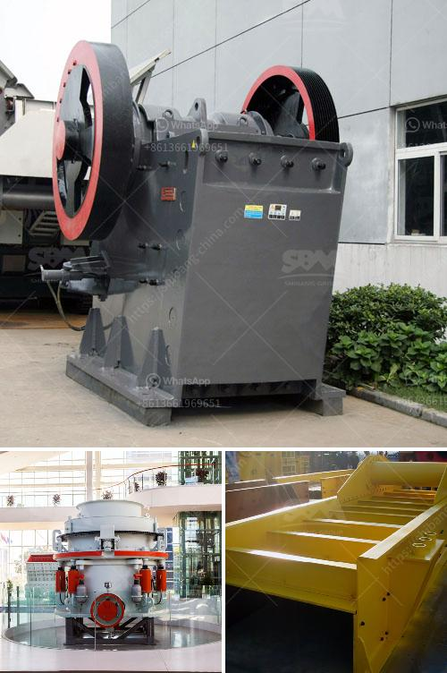

<h3>sell crusher of jaw in peru</h3>
Peru is a country blessed with abundant mineral resources, making mining one of its most important economic sectors. With increasing investments in the sector, the demand for high-quality mining equipment, such as jaw crushers, has significantly risen. This presents a lucrative opportunity for those looking to sell crushers of jaw in Peru.

Jaw crushers are versatile machines widely used in the mining and construction industries. They are primarily used to crush large rocks and ores into smaller particles, making them easier to handle and process. Their sturdy construction, efficient operation, and ability to handle various types of materials make them essential equipment in mining operations.

Peru is known for its vast copper, gold, and silver reserves, making it a preferred destination for mining companies worldwide. These companies require heavy-duty equipment to extract, crush, and process the minerals effectively. This is where jaw crushers come into play.

Selling jaw crushers in Peru can be highly profitable, given the country's mining boom. The ever-increasing demand for minerals, fueled by industrialization and urbanization, has resulted in a constant need for efficient mining equipment. Jaw crushers excel in crushing different types of ores and rocks, enabling mining companies to extract minerals more effectively and efficiently.

Moreover, with advancements in technology, jaw crushers have become more efficient, cost-effective, and environmentally friendly. Many modern jaw crushers are designed to consume less energy while providing higher output, reducing the overall operational costs for mining companies.

To tap into the growing demand for jaw crushers in Peru, sellers must understand the local market trends, customer preferences, and specific requirements. Establishing partnerships with local mining companies, attending mining exhibitions, and creating a strong online presence are crucial steps to successfully selling crushers of jaw in Peru.

In conclusion, selling jaw crushers in Peru presents an excellent business opportunity due to the country's thriving mining industry. With its vast mineral resources and increasing investments in the sector, the demand for high-quality mining equipment is on the rise. By providing efficient and reliable jaw crushers, sellers can contribute to the mining sector's growth while reaping significant financial rewards.
<h3>Contact us</h3><ul><li><strong>Whatsapp:&nbsp;<a href="https://wa.me/8613661969651">+8613661969651</a></strong></li><li><a href="https://swt.shibang-china.com/?git&amp;zhl&amp;sell crusher of jaw in peru"><strong>Online Service(chat now)</strong></a></li></ul><h3>Related</h3><ul><li><a href='average cost of graphite mining plant.md'>average cost of graphite mining plant</a></li><li><a href='gypsum board manufacturing machines prices inindia.md'>gypsum board manufacturing machines prices inindia</a></li><li><a href='stone crusher machine price in philippines.md'>stone crusher machine price in philippines</a></li><li><a href='concrete crushing plant in dubai.md'>concrete crushing plant in dubai</a></li><li><a href='what is the meaning of 100tph in crusher crusher.md'>what is the meaning of 100tph in crusher crusher</a></li></ul>