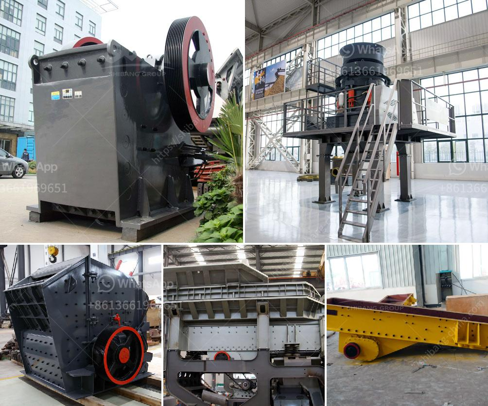

<h3>sell mill of hammers malaysia</h3>
Located in the heart of Southeast Asia, Malaysia has been recognized as a leading player in various industrial sectors. One such industry is the manufacturing and export of hammer mills, a vital tool used in numerous sectors. This article aims to shed light on the significance of the hammer mill industry in Malaysia, its evolution, and its contribution to the nation's economy.

Over the years, Malaysia has emerged as a significant exporter of raw materials, including palm oil, rubber, and timber. These natural resources spurred the growth of various industries, including the manufacturing of tools and equipment like hammer mills.

The hammer mill, a versatile machine designed to crush or pulverize materials into smaller pieces, quickly became essential across multiple sectors. Backed by the expertise of Malaysian manufacturers, these mills gained recognition for their efficiency, reliability, and durability, leading to an increase in the demand for locally-produced hammer mills.

With the rise of Malaysia's hammer mill industry, the domestic market for these machines flourished. However, what truly propelled the industry's growth was its ability to tap into international markets. Malaysian manufacturers capitalized on the demand for hammer mills globally, primarily targeting countries with thriving agriculture, construction, and mining sectors.

Southeast Asian neighbors such as Indonesia, Thailand, and Vietnam became key markets, relying on Malaysia's hammer mill expertise, as the machines played a critical role in their respective industries. Additionally, Malaysian hammer mill manufacturers successfully penetrated markets further afield, including Australia, China, and Europe.

To remain competitive in today's rapidly evolving global market, Malaysia's hammer mill manufacturers invested heavily in research and development. This emphasis on technological advancements resulted in the production of high-performance hammer mills equipped with features like improved crushing mechanisms, energy efficiency, and easy maintenance.

The integration of computer-aided design and manufacturing techniques further enhanced the precision, speed, and customization options offered by Malaysian hammer mill manufacturers. These advancements not only bolstered the reputation of Malaysian hammer mills but also resulted in increased export opportunities.

The hammer mill industry has been a significant contributor to Malaysia's economic growth. The export of hammer mills has generated substantial revenue for the nation, contributing to its trade surplus. This industry's success has also led to direct and indirect employment of thousands of Malaysians, further boosting the country's economy.

Moreover, increased research and development efforts have led to the growth of the local engineering sector, as well as other supporting industries such as steel fabrication, electrical component manufacturing, and transportation services. These interdependent industries have formed a robust ecosystem that feeds into Malaysia's hammer mill industry, driving the nation's economic growth.

Malaysia's hammer mill industry has come a long way, transforming from a domestic market to an internationally recognized player in manufacturing and exporting. The country's focus on technological advancements, high-quality manufacturing, and a diverse range of applications has positioned it at the forefront of the hammer mill industry.

As Malaysia continues to adapt to global market trends, it is evident that the hammer mill industry will play a pivotal role in the nation's economic stability and growth. Through innovative manufacturing practices, Malaysia is well-positioned to further solidify its reputation as a leading exporter of hammer mills worldwide.
<h3>Contact us</h3><ul><li><strong>Whatsapp:&nbsp;<a href="https://wa.me/8613661969651">+8613661969651</a></strong></li><li><a href="https://swt.shibang-china.com/?git&amp;zhl&amp;sell mill of hammers malaysia"><strong>Online Service(chat now)</strong></a></li></ul><h3>Related</h3><ul><li><a href='crusher stone crusher 10x20.md'>crusher stone crusher 10x20</a></li><li><a href='rock crusher in antioquia rock.md'>rock crusher in antioquia rock</a></li><li><a href='italia gypsum block making mechines.md'>italia gypsum block making mechines</a></li><li><a href='turkish manufacturer belt conveyor.md'>turkish manufacturer belt conveyor</a></li><li><a href='track impact crusher.md'>track impact crusher</a></li></ul>