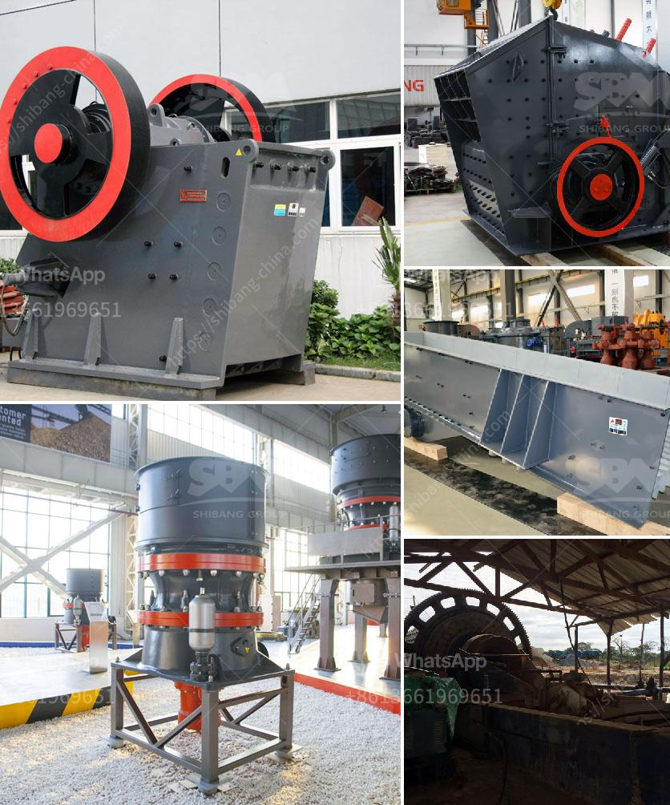

<h3>set up coal pulverizer plant</h3>
Setting up a coal pulverizer plant can be a complex and challenging process. However, with careful planning and diligent execution, it can yield significant benefits in terms of energy efficiency and cost savings. In this article, we will discuss the steps involved in setting up a coal pulverizer plant.

The first step in setting up a coal pulverizer plant is to choose an appropriate location. The plant should be situated near the coal mine, so transportation costs are minimized. Additionally, the chosen location should have sufficient space for all the necessary equipment and facilities.

Once the location has been finalized, the next step is to obtain the required permits and approvals from the relevant authorities. This may involve obtaining an environmental clearance, as coal pulverizer plants can have a significant impact on air and water quality. It is important to comply with all local regulations and guidelines to ensure the plant operates in a responsible and sustainable manner.

After obtaining the necessary permits, it is time to procure the equipment and machinery required for the coal pulverizer plant. The key component of the plant is the pulverizer, which crushes the coal into fine particles. Other equipment, such as feeders, conveyors, and classifiers, may also be required depending on the specific needs of the plant.

During the installation process, it is crucial to follow the manufacturer's instructions and guidelines to ensure the equipment is set up correctly. This includes ensuring proper ventilation, electrical connections, and alignment of the components. It is advisable to engage qualified professionals with experience in setting up coal pulverizer plants to ensure the installation is done safely and efficiently.

Once the equipment is installed, the next step is to commission the plant. During this stage, various tests and inspections are conducted to ensure the equipment is functioning as intended. This includes testing the performance of the pulverizer, monitoring the emission levels, and verifying the efficiency of the plant.

To ensure the smooth operation of the plant, regular maintenance and servicing are essential. This includes routine inspections, lubrication, and cleaning of the equipment. It is important to follow a preventive maintenance schedule to minimize downtime and maximize the lifespan of the equipment.

In conclusion, setting up a coal pulverizer plant requires careful planning, obtaining the necessary permits, procuring the equipment, and following the manufacturer's instructions for installation. Regular maintenance and servicing are crucial for the smooth and efficient operation of the plant. By investing time and effort into setting up a coal pulverizer plant, it is possible to achieve significant energy efficiency and cost savings, while also ensuring compliance with environmental regulations.
<h3>Contact us</h3><ul><li><strong>Whatsapp:&nbsp;<a href="https://wa.me/8613661969651">+8613661969651</a></strong></li><li><a href="https://swt.shibang-china.com/?git&amp;zhl&amp;set up coal pulverizer plant"><strong>Online Service(chat now)</strong></a></li></ul><h3>Related</h3><ul><li><a href='cement grinding station quotations.md'>cement grinding station quotations</a></li><li><a href='gold processing equipment for sale in zimbabwe.md'>gold processing equipment for sale in zimbabwe</a></li><li><a href='grinding mills jalandhar.md'>grinding mills jalandhar</a></li><li><a href='canadian gold mining equipment manufacturers.md'>canadian gold mining equipment manufacturers</a></li><li><a href='how much investment in bauxite crushing plant.md'>how much investment in bauxite crushing plant</a></li></ul>