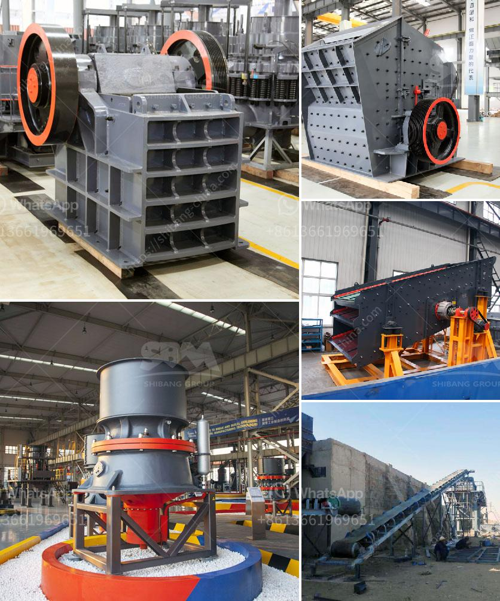

<h3>silica iron ore silver seperation machine</h3>
Silica, iron ore, and silver are valuable minerals that play important roles in various industries. However, before these minerals can be used for commercial purposes, they need to be separated from each other. This is where the silica iron ore silver separation machine comes into play.

The silica iron ore silver separation machine is a specialized piece of equipment that utilizes magnetic forces to extract these three minerals from one another. This separation process is crucial because it allows for the refinement and purification of these minerals, making them suitable for use in various industries.

One of the key components of the silica iron ore silver separation machine is the magnetic drum. This drum is equipped with powerful magnets that create a magnetic field. As the raw materials pass through this magnetic field, the magnetic force attracts the metallic components, which in this case are the iron ore and silver.

The magnetic drum has a high-capacity design, allowing it to process large quantities of material at once. This is important because high volumes of silica iron ore and silver need to be processed to meet the demands of industries such as mining, manufacturing, and electronics.

The silica iron ore silver separation machine also features a conveyor belt system. This system helps to transport the raw materials through the machine, ensuring a consistent and efficient separation process. The conveyor belt speed can be adjusted, allowing for different processing rates depending on the specific requirements of the industry.

Another critical element of this separation machine is the vibrating feeder. The vibrating feeder ensures a steady and uniform flow of material onto the conveyor belt, preventing any blockages or inconsistencies. This helps to maximize the efficiency of the separation process and ensure a high-quality end product.

In addition to its efficient separation capabilities, the silica iron ore silver separation machine is also designed with safety and environmental considerations in mind. The machine is equipped with safety sensors and guards to prevent accidents and protect operators. It also incorporates an advanced dust collection system to minimize airborne particles and reduce the impact on the environment.

Overall, the silica iron ore silver separation machine is a valuable tool in the mining and processing industry. It allows for the efficient extraction and purification of these minerals, ensuring their suitability for various commercial applications. With its advanced features and emphasis on safety and environmental responsibility, this machine is an essential asset for any company involved in the extraction and refinement of silica, iron ore, and silver.
<h3>Contact us</h3><ul><li><strong>Whatsapp:&nbsp;<a href="https://wa.me/8613661969651">+8613661969651</a></strong></li><li><a href="https://swt.shibang-china.com/?git&amp;zhl&amp;silica iron ore silver seperation machine"><strong>Online Service(chat now)</strong></a></li></ul><h3>Related</h3><ul><li><a href='bentonite grinding machines price.md'>bentonite grinding machines price</a></li><li><a href='cement plant layout consultants in south kolkata.md'>cement plant layout consultants in south kolkata</a></li><li><a href='vibration screen machine.md'>vibration screen machine</a></li><li><a href='pulverizer mining crusher 200 mesh.md'>pulverizer mining crusher 200 mesh</a></li><li><a href='stone crushers companies in tanzania.md'>stone crushers companies in tanzania</a></li></ul>