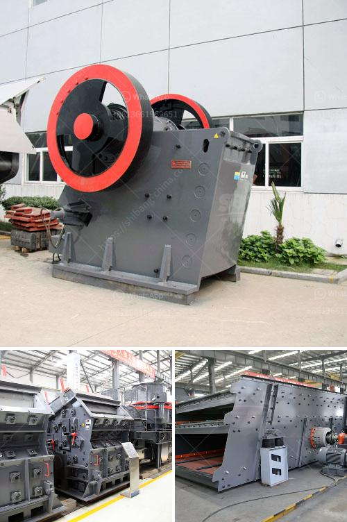

<h3>silica sand crusher machinery</h3>
Silica sand is the most commonly used raw material for glass manufacturing. It is used in vast quantities in construction, ceramics, metallurgy, electronics, paints, plastics, and various other industries. However, the production process of silica sand involves crushing, screening, and washing, which consumes a significant amount of water, contributing to water scarcity in many areas.

To address this issue, silica sand crusher machinery plays a crucial role in the silica sand processing plant. The equipment is used to crush, grind, and screen the silica sand to meet the specifications required for making glass, ceramics, and other products. Usually, the silica sand crusher machinery includes jaw crushers, impact crushers, cone crushers, and VSI crushers.

Jaw Crusher: This primary crusher machine is designed to break large-sized silica sand into smaller particles for further processing. It features high crushing ratio, uniform particle size, simple structure, reliable performance, easy maintenance, and low operating costs.

Impact Crusher: The impact crusher is commonly used in the secondary crushing stage. It can crush silica sand into smaller particles ranging from 0-50mm. Its high-speed rotating rotor throws the silica sand against the crushing chamber walls, crushing them into fine particles. The impact crusher offers high crushing efficiency and excellent cubicity of the final product.

Cone Crusher: The cone crusher is another machine commonly used in the secondary or tertiary crushing stage. It can crush silica sand into smaller particles ranging from 0-20mm. The crushing chamber is designed to provide a high reduction ratio, ensuring the production of high-quality silica sand.

VSI Crusher: The VSI crusher, also known as the vertical shaft impact crusher, is a commonly used machine in the final stage of crushing. It produces cubic-shaped silica sand particles, which are ideal for making high-quality glass and ceramics. The VSI crusher is highly efficient in terms of energy consumption and maintenance, offering cost-effective crushing solutions.

In addition to the above-mentioned crushers, the silica sand crusher machinery may also include vibrating feeders, vibrating screens, sand washers, and conveyors to facilitate the complete silica sand processing operation.

It is important to mention that the use of efficient silica sand crusher machinery not only improves the quality of the final product but also reduces environmental impact, specifically water consumption. With water scarcity being a significant concern globally, the use of water-saving technologies in silica sand processing is crucial.

In conclusion, the silica sand crusher machinery plays a vital role in the silica sand processing plant. It helps in crushing, grinding, and screening the silica sand to meet the required specifications for various industries. The use of efficient crusher machinery not only improves the quality of silica sand products but also contributes to mitigating water scarcity issues.
<h3>Contact us</h3><ul><li><strong>Whatsapp:&nbsp;<a href="https://wa.me/8613661969651">+8613661969651</a></strong></li><li><a href="https://swt.shibang-china.com/?git&amp;zhl&amp;silica sand crusher machinery"><strong>Online Service(chat now)</strong></a></li></ul><h3>Related</h3><ul><li><a href='cost of setting up gypsum processing factory.md'>cost of setting up gypsum processing factory</a></li><li><a href='vertical shaft impact crusher for sale.md'>vertical shaft impact crusher for sale</a></li><li><a href='stone crusher output per hour india.md'>stone crusher output per hour india</a></li><li><a href='blake jaw crusher.md'>blake jaw crusher</a></li><li><a href='cost estimates of a chrome processing plant.md'>cost estimates of a chrome processing plant</a></li></ul>