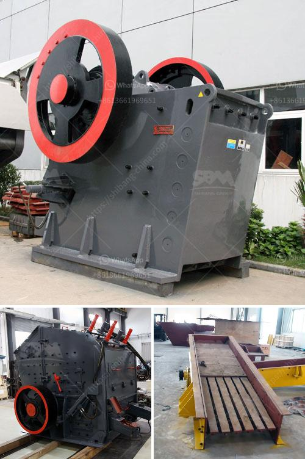

<h3>silica sand mines in philippines</h3>
Once dubbed as the "Sleeping Dragon," the Philippines has steadily risen in the ranks as one of the fastest-growing economies in Asia. Amidst its promising growth potential, the country is also home to vast mineral resources, including silica sand—a valuable commodity used in numerous industries such as construction, glass manufacturing, and oil and gas exploration.

Silica sand, also known as quartz sand, is composed of silicon dioxide (SiO2). It is primarily found in the form of granules, ranging from fine to coarse, making it an ideal material for a wide range of applications. Aside from its versatility, silica sand is also highly abundant, which positions the Philippines as a prominent player in the global silica sand market.

One of the main regions where silica sand mining operations have been thriving is in the province of Ilocos Norte, located in the northern part of Luzon. The province is known for its vast coastal areas, where silica sand deposits are found. These deposits are a result of the erosion and weathering of quartz-bearing igneous and metamorphic rocks, carried by rivers and deposited along the shoreline.

Silica sand mining has been a significant contributor to the local economy in Ilocos Norte. It provides employment opportunities for the local communities, stimulating economic growth and reducing poverty rates. Moreover, the revenue generated from silica sand mining activities directly contributes to the province's development, enabling the government to fund infrastructure projects and improve public services.

However, the rapid expansion of silica sand mining operations also poses potential environmental challenges. The extraction process involves the use of heavy machinery and water, which can result in soil erosion, habitat destruction, and water pollution. Additionally, the transportation of silica sand from the mines to the processing facilities and export ports may contribute to air pollution and traffic congestion.

To address these concerns, the Philippine government has implemented various regulations and guidelines to ensure sustainable silica sand mining practices. Environmental Impact Assessments (EIAs) are conducted to evaluate the potential environmental and social impacts of mining activities. Strict monitoring and enforcement of proper waste management and reclamation procedures are also carried out to mitigate the negative effects on the environment.

Furthermore, initiatives are being taken to promote responsible and sustainable mining practices in the silica sand industry. Collaboration between the government, mining companies, and local communities is crucial to strike a balance between economic development and environmental conservation. Stakeholder engagement and consultation processes allow for the inclusion of different perspectives, ensuring that the interests of all parties involved are taken into account.

As the global demand for silica sand continues to rise, the Philippines remains well-positioned to cater to this demand with its abundant resources and competitive pricing. However, it is vital to strike a balance between economic gain and environmental sustainability. With proper management and regulations in place, silica sand mining can contribute to the country's economic growth while preserving the beauty and biodiversity of the Philippines' natural resources.

In conclusion, silica sand mining in the Philippines has become a significant contributor to the local economy, providing employment opportunities and generating revenue for development. Nevertheless, sustainable mining practices and environmental conservation should remain a priority to ensure the long-term viability of this valuable resource.
<h3>Contact us</h3><ul><li><strong>Whatsapp:&nbsp;<a href="https://wa.me/8613661969651">+8613661969651</a></strong></li><li><a href="https://swt.shibang-china.com/?git&amp;zhl&amp;silica sand mines in philippines"><strong>Online Service(chat now)</strong></a></li></ul><h3>Related</h3><ul><li><a href='gypsum crusher for sale india.md'>gypsum crusher for sale india</a></li><li><a href='the price of a ball mill in india.md'>the price of a ball mill in india</a></li><li><a href='type of crusher machine is best.md'>type of crusher machine is best</a></li><li><a href='chrome washing plant for sale south africa.md'>chrome washing plant for sale south africa</a></li><li><a href='aggregate processing equipment.md'>aggregate processing equipment</a></li></ul>