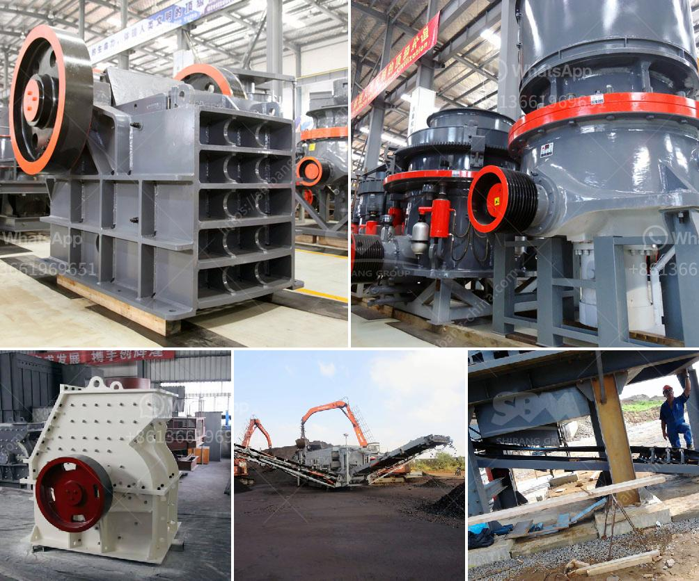

<h3>silica sand quarry for sale in tunisia in cork ireland</h3>
Cork, Ireland, has long been recognized as a major hub for industrial investment due to its strategic location and business-friendly environment. For potential investors seeking lucrative opportunities, the silica sand quarry for sale in Tunisia presents an intriguing prospect. With its abundance of high-quality silica sand, Tunisia has emerged as one of the leading suppliers to various industries worldwide. This article delves into the potential advantages of investing in this quarry, shedding light on the market potential and the benefits it offers.

Tunisia boasts vast reserves of high-quality silica sand, making it an attractive destination for investors in the sector. Silica sand is a crucial raw material used in a multitude of industries, including glass manufacturing, building construction, ceramics, oil and gas exploration, and hydraulic fracturing (fracking). Its diverse applications make it a highly sought-after commodity, ensuring a steady demand in both domestic and international markets.

The location of the silica sand quarry in Tunisia adds another layer of attractiveness for potential investors. Cork, Ireland, serves as an ideal location due to its proximity to both the European market and the North African region. This strategic location significantly reduces transportation costs and enables efficient supply chain management, enabling investors to tap into both local and international clientele seamlessly.

As mentioned earlier, the demand for silica sand is on a continuous rise, driven by the expanding construction and glass manufacturing sectors. With Tunisia's silica sand being widely recognized as both high-quality and competitive in the global market, investing in a quarry here ensures a solid customer base and a high return on investment. Furthermore, the rapid growth of the oil and gas industry worldwide, specifically in hydraulic fracturing, further bolsters the demand for silica sand.

Investing in a foreign country demands consideration of various factors, including political stability and a welcoming business environment. Tunisia provides both, with a stable political landscape and a progressive government committed to promoting foreign direct investments. The country has implemented various incentives, such as tax exemptions, streamlined bureaucracy, and free-trade agreements, all conducive to fostering a supportive business climate.

The opportunity to invest in a silica sand quarry in Tunisia offers promising returns for discerning investors. Cork, Ireland, serves as an advantageous location, facilitating easy access to both local and international markets. With Tunisia's vast silica sand reserves and increasing demand across multiple industries, the potential for a profitable venture is significant. Moreover, the country's political stability and favorable investment landscape make it an attractive prospect for those seeking to diversify their portfolio. In summary, investing in this silica sand quarry in Tunisia represents a sound business decision, grounded in promising market potential and various appealing factors for potential investors.
<h3>Contact us</h3><ul><li><strong>Whatsapp:&nbsp;<a href="https://wa.me/8613661969651">+8613661969651</a></strong></li><li><a href="https://swt.shibang-china.com/?git&amp;zhl&amp;silica sand quarry for sale in tunisia in cork ireland"><strong>Online Service(chat now)</strong></a></li></ul><h3>Related</h3><ul><li><a href='pebble crusher for grinding mill.md'>pebble crusher for grinding mill</a></li><li><a href='mobile gold processing plant with price.md'>mobile gold processing plant with price</a></li><li><a href='concrete aggregates crushing plant for sale.md'>concrete aggregates crushing plant for sale</a></li><li><a href='screen and crusher hire.md'>screen and crusher hire</a></li><li><a href='stationary screening for screening process.md'>stationary screening for screening process</a></li></ul>