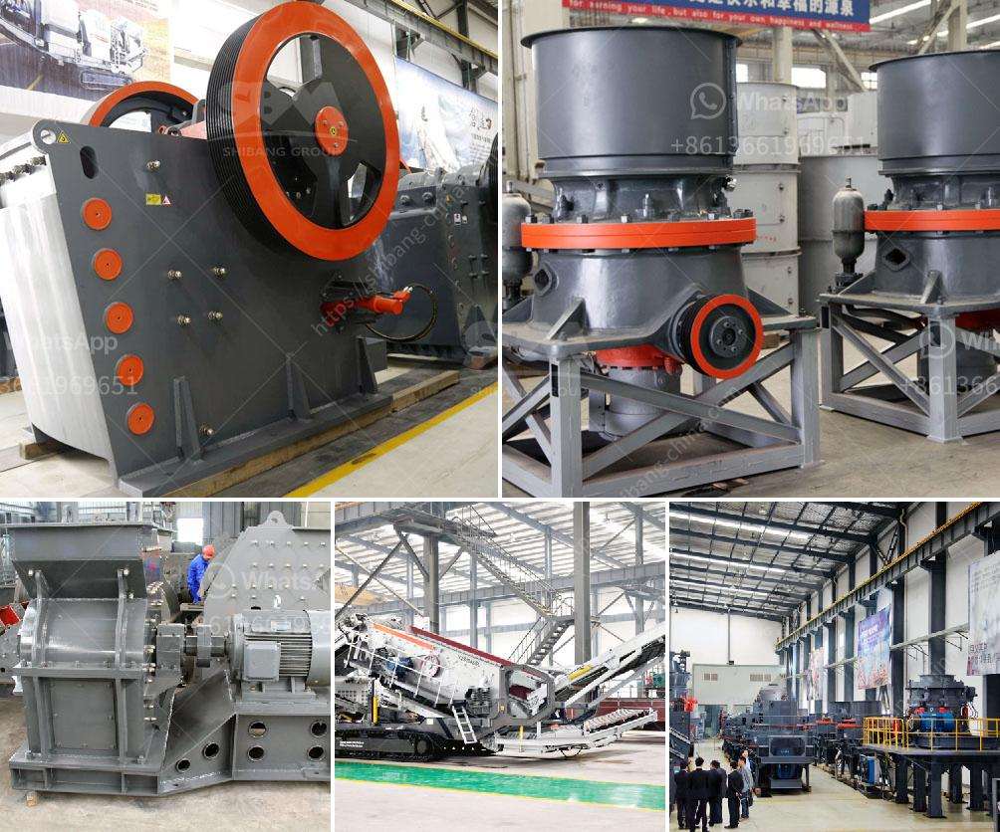

<h3>simple formula for belt conveyor counter weight</h3>
A belt conveyor is a machine that is used to convey items from one point to another in a moving belt. It mainly consists of a pulley system with a loop of the rotating belt that goes around them. Countless industries rely on this equipment to efficiently move goods and materials, making it an essential component of the manufacturing process.

One of the critical aspects of a belt conveyor's functioning is its counterweight. The belt conveyor counterweight serves as a balancing force to the pulley system, ensuring that the belt runs smoothly and without any hitches. It is responsible for offsetting the weight of the goods being conveyed, ensuring that the belt remains tensioned and in continuous motion.

Calculating the proper weight for the counterweight can be challenging, but there is a simple formula that you can follow. This formula requires you to know the total weight of the goods being conveyed, the length of the conveyor belt, and the speed at which it is moving.

The formula for calculating the counterweight relies on the basic principles of physics and the relationship between gravity, mass, and acceleration.

Firstly, you need to determine the total weight of the goods being conveyed. This can be calculated by summing up the weights of all the items on the belt. Make sure to consider the weight of the goods in both the loaded and unloaded conditions.

Next, you need to know the length of the conveyor belt. This is the distance that the belt covers in a complete loop around the pulley system. Measure the actual length of the belt, accounting for any inclines or declines.

Lastly, determine the speed at which the belt is moving. This is typically measured in meters per second (m/s) or feet per second (ft/s). It indicates how fast the belt is moving, and it significantly impacts the counterweight calculation.

In this formula, "Total Weight" is the weight of the goods being conveyed, "Length" is the length of the conveyor belt, "Speed" is the speed at which the belt is moving, and "9.81" represents the acceleration due to gravity.

By plugging in the corresponding values into the formula and performing the calculations, you will obtain the counterweight that should be added to your belt conveyor system. This counterweight will help balance the force exerted by the goods being conveyed, ensuring a smooth and efficient operation.

Proper sizing and adjustment of the counterweight is crucial for the safe and effective functioning of the belt conveyor. It is recommended to consult with a qualified engineer or conveyor manufacturer to ensure accurate calculations and compliance with industry standards.

In conclusion, a belt conveyor's counterweight plays a vital role in maintaining the tension and proper functioning of the conveyor belt. By following the simple formula mentioned above, you can accurately calculate the counterweight, improve efficiency, and ensure the safety of your conveyor system.
<h3>Contact us</h3><ul><li><strong>Whatsapp:&nbsp;<a href="https://wa.me/8613661969651">+8613661969651</a></strong></li><li><a href="https://swt.shibang-china.com/?git&amp;zhl&amp;simple formula for belt conveyor counter weight"><strong>Online Service(chat now)</strong></a></li></ul><h3>Related</h3><ul><li><a href='calcium carbonate mines in pakistan.md'>calcium carbonate mines in pakistan</a></li><li><a href='hammer mill grinder 10 mm.md'>hammer mill grinder 10 mm</a></li><li><a href='mobile stone crusher available for hire.md'>mobile stone crusher available for hire</a></li><li><a href='used vertical grinding machine.md'>used vertical grinding machine</a></li><li><a href='ball mill turkey fabricant.md'>ball mill turkey fabricant</a></li></ul>