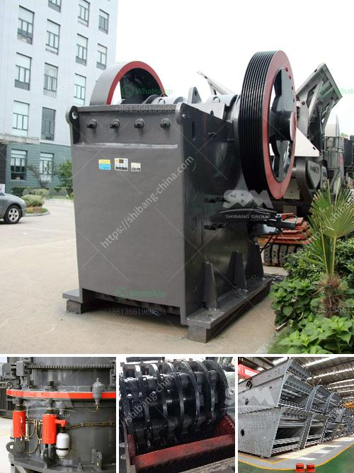

<h3>simple stone crushing machine price in kenya</h3>
The stone crushing machine price in Kenya is affected by various factors such as the materials used for crushing, the technology level, market demand and regional competition. The stone crushing machine price has been difficult to ascertain due to the uncertainty of the global economy and various factors affecting it. This article aims to provide a clearer understanding of the factors influencing the price of stone crushing machines in Kenya.

Firstly, the stone crushing machine price in Kenya is affected by the raw materials used to make the equipment. Raw materials are mainly natural resources such as marble, rocks, limestone, and granite. These natural resources are used to make various construction materials, such as aggregates, sand, cement, and concrete. If the raw materials used in the production of stone crushing machines are not processed properly, the equipment will have a lower price.

Secondly, the technology level of the stone crushing machine will also affect the price. The higher the technology level, the more advanced the equipment, the higher the working efficiency of the machine, the price will be higher. On the contrary, the price of machine with low technology content will be relatively lower.

Thirdly, the market demand is a factor affecting the price of stone crushing machines in Kenya. The last few years, market demand has become increasingly large. The demand for stone crushing machines is also increased year by year. The competition in the market is also fierce. As a result, manufacturers have to invest more to attract customers' attention and stand out from the competition. In this case, the price of stone crushing machines will increase.

Lastly, the regional competition will also affect the stone crushing machine price. The regional competition among different manufacturers directly affects the price of stone crushing machines in the local market. Prices in different regions are also affected by factors such as transportation costs and government policies.

In conclusion, the price of stone crushing machines in Kenya depends on a variety of factors, including the raw materials used to make the equipment, the technology level, market demand and regional competition. These factors should be considered when choosing and purchasing equipment. In addition, you should also consider the after-sales service and technical support provided by the manufacturer. Therefore, it is important to do thorough research and compare various options before making a purchase.
<h3>Contact us</h3><ul><li><strong>Whatsapp:&nbsp;<a href="https://wa.me/8613661969651">+8613661969651</a></strong></li><li><a href="https://swt.shibang-china.com/?git&amp;zhl&amp;simple stone crushing machine price in kenya"><strong>Online Service(chat now)</strong></a></li></ul><h3>Related</h3><ul><li><a href='advantages and disadvantages of ball mill grinding.md'>advantages and disadvantages of ball mill grinding</a></li><li><a href='pulverizer mining crusher 200 mesh.md'>pulverizer mining crusher 200 mesh</a></li><li><a href='chrome processing plant price.md'>chrome processing plant price</a></li><li><a href='ball mill installation.md'>ball mill installation</a></li><li><a href='hand ball mill in south africa.md'>hand ball mill in south africa</a></li></ul>