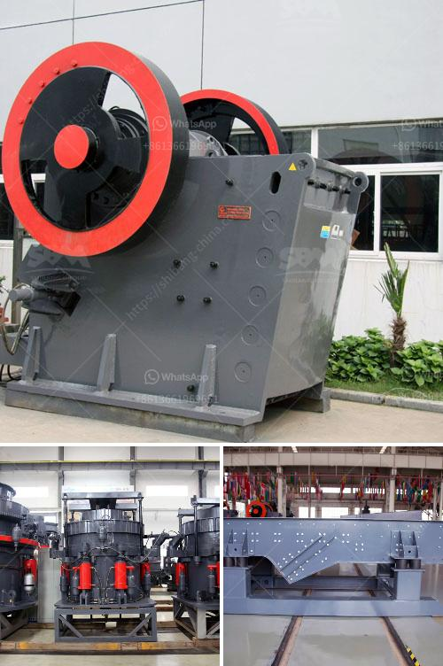

<h3>single super phosphate plants in germany</h3>
Single superphosphate (SSP) plants in Germany play a significant role in the agricultural sector by producing a high-quality fertilizer. This nutrient-rich product is essential in improving soil fertility and enhancing crop yields. Let's delve into the details and explore the importance of these plants in Germany's agricultural landscape.

Single superphosphate is a type of fertilizer derived from phosphate rock that undergoes a chemical reaction to produce a concentrated form of phosphorus. This nutrient is vital for plant growth, as it aids in root development, energy transfer, and flowering. SSP is an excellent source of phosphorus for all types of crops, including cereals, fruits, vegetables, and oilseeds.

Germany's SSP plants are equipped with advanced technology and efficient production processes, ensuring the production of a high-quality fertilizer. These plants receive raw materials, mainly phosphate rock, sulfuric acid, and occasionally phosphoric acid, to initiate the chemical reaction that produces SSP. They follow strict quality control measures at every step to guarantee consistent nutrient composition in their final product.

The versatility and effectiveness of SSP make it an indispensable fertilizer option for German farmers. Its benefits extend beyond phosphorus supply, as the sulfur content in SSP also aids in various biological processes within plants. This promotes healthy growth and ensures optimal nutrient absorption, leading to improved crop quality and quantity.

Continuous use of SSP in crop production systems allows farmers to replenish essential nutrients in the soil. As crops absorb phosphorus and other nutrients during their growth cycle, the soil's nutrient levels gradually diminish. The application of SSP helps restore and maintain the soil's fertility, ensuring sustainable agricultural practices.

Furthermore, SSP plays a crucial role in promoting environmental sustainability in German agriculture. By ensuring efficient nutrient management, these plants contribute to minimizing phosphorus runoff, which can have detrimental effects on water bodies. The controlled application of SSP on fields helps prevent excessive nutrient leaching, reducing the risk of water pollution and protecting aquatic ecosystems.

Another advantage of SSP is its ease of application. German farmers can apply SSP directly to the soil, either by broadcasting or band placement, making it convenient and cost-effective. SSP's applicability to a wide range of soils and crops further enhances its practicality, allowing farmers to cater to their specific needs and achieve optimum results.

In conclusion, single superphosphate plants in Germany are vital pillars of the agricultural sector. Their production of high-quality SSP ensures the availability of essential nutrients for crops, leading to improved soil fertility and increased yields. By promoting sustainable agricultural practices, these plants contribute to preserving the environment and protecting water bodies. The versatility and ease of application of SSP further enhance its appeal as a go-to fertilizer for German farmers. Thus, these plants remain crucial in ensuring the success and productivity of Germany's agricultural industry.
<h3>Contact us</h3><ul><li><strong>Whatsapp:&nbsp;<a href="https://wa.me/8613661969651">+8613661969651</a></strong></li><li><a href="https://swt.shibang-china.com/?git&amp;zhl&amp;single super phosphate plants in germany"><strong>Online Service(chat now)</strong></a></li></ul><h3>Related</h3><ul><li><a href='limestone crusher philippines.md'>limestone crusher philippines</a></li><li><a href='hot selling coal mine roller crushing plant in india.md'>hot selling coal mine roller crushing plant in india</a></li><li><a href='vibrating screen for recycling costs.md'>vibrating screen for recycling costs</a></li><li><a href='grinding mill machine kenya.md'>grinding mill machine kenya</a></li><li><a href='cost per tonne crushing iron ore.md'>cost per tonne crushing iron ore</a></li></ul>