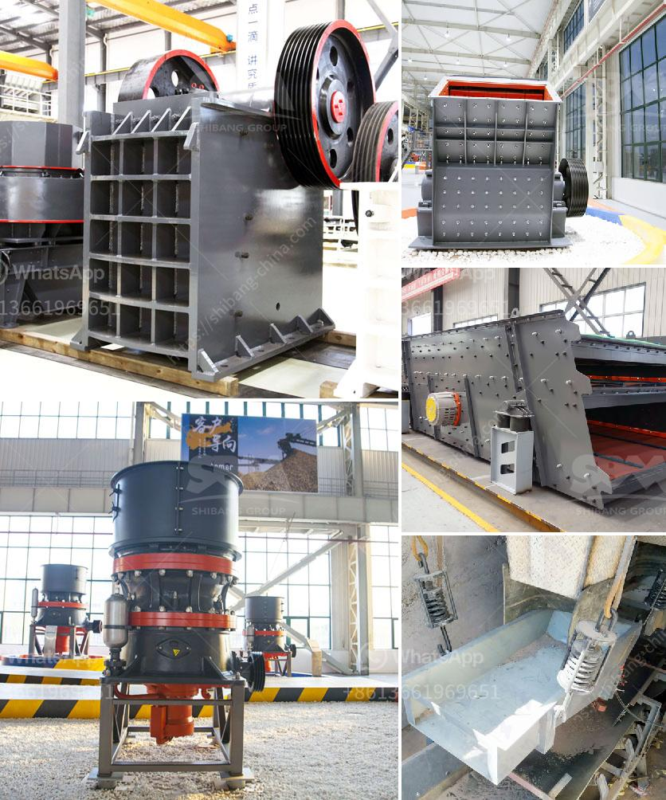

<h3>sizing jaw crusher</h3>
When it comes to the construction industry, aggregates play a vital role. Crushers are the primary machines used for the processing of raw materials, from quarrying to recycling operations. Jaw crushers are one of the most commonly used crushers due to their ability to crush all kinds of materials of any hardness, as well as their low-cost operation and easy maintenance.

Sizing a jaw crusher is not an easy task, as the various factors affecting the crushing capacity need to be considered. These factors include the top-size of the feed material, the closed side setting (CSS), the feed gradation, and the hardness of the material being crushed.

The first step in sizing a jaw crusher is to determine the maximum feed size that the crusher can handle. This is important as it directly affects the crushing capacity of the crusher. The maximum feed size should not exceed 80-85% of the jaw crusher's opening dimension. A larger feed size can cause blockages and reduce the crushing capacity of the crusher.

The closed side setting (CSS) is the smallest distance between the jaw plates during the crushing process. It determines the size of the product produced by the crusher. A smaller CSS results in a finer product size, while a larger CSS results in a coarser product size. The CSS should be set to achieve the desired product size, considering the specific requirements of the project.

The feed gradation refers to the distribution of the particle sizes in the feed material. It is essential to have a well-graded feed material to achieve optimal crushing performance. A well-graded feed ensures that the crusher receives a continuous flow of material and prevents excessive wear on the jaw plates. The feed gradation can be controlled by ensuring a consistent feed size distribution from the primary crusher or using a screening plant to remove fines and undersized material.

The hardness of the material being crushed also affects the sizing of a jaw crusher. Harder materials require more energy to crush and may require a larger crusher with a higher horsepower. Conversely, softer materials can be crushed more easily and may not require as powerful of a crusher.

To determine the appropriate size of a jaw crusher, it is essential to consult with experts in the field, such as equipment manufacturers or engineers. They can provide valuable guidance based on the specific requirements of the project and the characteristics of the feed material.

In conclusion, sizing a jaw crusher involves considering various factors that affect the crushing capacity of the crusher. These include the maximum feed size, the closed side setting, the feed gradation, and the hardness of the material. Consulting with experts in the field is vital to ensure the optimal size of the jaw crusher for a specific application. With the right size crusher, construction professionals can efficiently process aggregates and achieve the desired end product.
<h3>Contact us</h3><ul><li><strong>Whatsapp:&nbsp;<a href="https://wa.me/8613661969651">+8613661969651</a></strong></li><li><a href="https://swt.shibang-china.com/?git&amp;zhl&amp;sizing jaw crusher"><strong>Online Service(chat now)</strong></a></li></ul><h3>Related</h3><ul><li><a href='portable home gold processing machine.md'>portable home gold processing machine</a></li><li><a href='distributor philippines test sieve retsch.md'>distributor philippines test sieve retsch</a></li><li><a href='wet grinding of mica process and equipment.md'>wet grinding of mica process and equipment</a></li><li><a href='how to mine limestone small scale.md'>how to mine limestone small scale</a></li><li><a href='price of grinder machine.md'>price of grinder machine</a></li></ul>