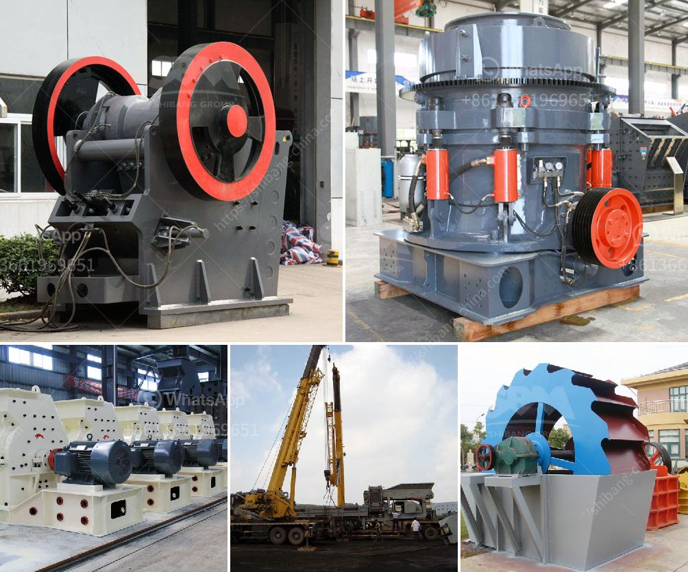

<h3>slag crusher plant</h3>
Slag, a byproduct of steel production, is commonly used as a raw material in the manufacturing of cement and concrete. However, the excess amount of slag can lead to environmental pollution and health hazards. To alleviate this issue, the slag crusher plant is designed to turn impure slag into useful materials.

Slag is a byproduct of the steelmaking process. It is an aggregate mixture of iron and non-ferrous components that remain after the removal of impurities from iron ore. The impurities, such as silicon, sulfur, and phosphorus, drastically reduce the quality of the steel produced. To remove these impurities, the slag is subjected to a crushing process.

The slag crusher plant works by converting excess slag into smaller, more manageable size fraction. This process is achieved by utilizing special equipment called slag crusher plant. The plant is useful in breaking down large pieces of slag into smaller, more manageable pieces, which then can be reused or sold.

One of the main components of the slag crusher plant is the vibrating feeder. The machine provides a constant and controlled feed to the crusher, ensuring smooth operation and minimizing downtime. Additionally, it separates the large-sized slag by removing any oversized material that could potentially damage the crusher.

The crusher itself is designed to crush the slag into small fragments, thus reducing its volume and facilitating its disposal or reuse. It features a durable construction, ensuring long-lasting performance even when dealing with heavy-duty applications. Moreover, the crusher is equipped with various safety features to protect the operator and prevent any accidents.

Overall, the slag crusher plant is an excellent solution for businesses that generate excessive amounts of slag. By recycling and reusing the slag, companies can reduce their environmental impact and save costs on material disposal. The plant not only helps in reducing pollution but also promotes sustainable development and responsible industrial practices.
<h3>Contact us</h3><ul><li><strong>Whatsapp:&nbsp;<a href="https://wa.me/8613661969651">+8613661969651</a></strong></li><li><a href="https://swt.shibang-china.com/?git&amp;zhl&amp;slag crusher plant"><strong>Online Service(chat now)</strong></a></li></ul><h3>Related</h3><ul><li><a href='cement plant in turkey.md'>cement plant in turkey</a></li><li><a href='used machines from china.md'>used machines from china</a></li><li><a href='stone crushing machines for sale in philippines.md'>stone crushing machines for sale in philippines</a></li><li><a href='machinery required for marble quarry crusher.md'>machinery required for marble quarry crusher</a></li><li><a href='barit mineral processing and extractive malaysia.md'>barit mineral processing and extractive malaysia</a></li></ul>