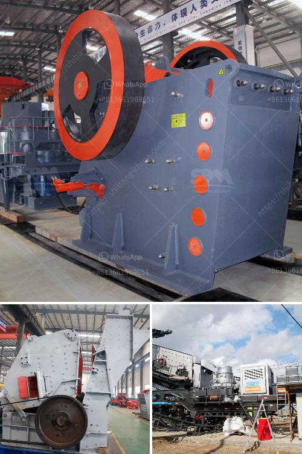

<h3>sliding shoe bearing ball mill skf</h3>
The sliding shoe bearing technology has been widely used in ball mill grinding operations. SKF, a leading bearing technology provider, has designed and developed a solution to this challenge. SKF's experience in bearing manufacturing, combined with applications expertise and optimization of design, have enabled them to produce the largest open spherical roller bearing in the world.

Sliding shoe bearing technology provides advantages over other bearing designs. It allows for easier adjustment of the mill which helps to achieve desired grinding results. The sliding shoe bearing technology supports the movement of the rotating mill shell within the bearings. This type of bearing allows for alignment and free movement of the bearing pads as they follow the movement of the mill shell.

SKF's expertise in bearing manufacturing has led to the development of a new design of sliding shoe bearings for ball mills. This innovative design combines the advantages of a conventional white metal bearing with advanced hydrodynamic lubrication technology, to ensure maximum uptime and low maintenance costs.

The SKF sliding shoe bearing range includes three series: Group 2, Group 3, and Group 4. These bearings have different bearing sizes and performance specifications. Group 2 bearings have a compact design and are mainly used in smaller mills or for mills using low bearing pressures. Group 3 bearings are applicable for medium and large mills with high bearing pressures. Group 4 bearings are designed for very large mills with high axial loads and have a simplified metal design.

The advantages of the SKF sliding shoe bearing technology are numerous. It provides reliable and long-lasting performance, reduces maintenance costs, and leads to higher productivity. The hydrodynamic lubrication system used in these bearings ensures proper and continuous lubrication, reducing friction and preventing bearing damage. This leads to longer bearing life and fewer shutdowns for maintenance.

The SKF sliding shoe bearing technology also provides a high level of alignment capability. The bearing pads are able to adjust to the movement of the mill shell, ensuring a perfect fit and alignment throughout the operation. This helps to minimize wear and tear on the bearings, as well as reduce energy consumption.

In conclusion, the SKF sliding shoe bearing technology is a proven solution for grinding mill applications. It provides reliable performance, reduced maintenance costs, and increased productivity. SKF's expertise in bearing manufacturing and their ongoing dedication to innovation have made them a global leader in this field. Whether it is a small mill or a large industrial operation, SKF has a solution to optimize grinding performance and reduce downtime.
<h3>Contact us</h3><ul><li><strong>Whatsapp:&nbsp;<a href="https://wa.me/8613661969651">+8613661969651</a></strong></li><li><a href="https://swt.shibang-china.com/?git&amp;zhl&amp;sliding shoe bearing ball mill skf"><strong>Online Service(chat now)</strong></a></li></ul><h3>Related</h3><ul><li><a href='aggregate processing equipment.md'>aggregate processing equipment</a></li><li><a href='continuous ball mill for sale in malaysia.md'>continuous ball mill for sale in malaysia</a></li><li><a href='china cone crushers.md'>china cone crushers</a></li><li><a href='raymond mill manufacturer in india.md'>raymond mill manufacturer in india</a></li><li><a href='jaw crusher maharashtra.md'>jaw crusher maharashtra</a></li></ul>