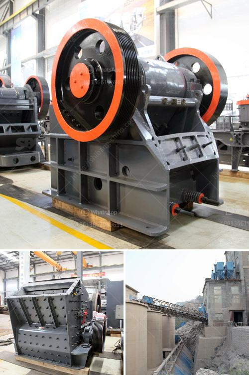

<h3>small ball mill for sale uk</h3>
If you are in the market for a small ball mill for sale in the UK, you are in luck. The industrial revolution laid the foundation for the development of advanced machinery and tools. As a result, various industries, including mining, have benefited tremendously. A small ball mill can be a versatile machine to reduce the size of particles, but the choices you make for your operations can greatly impact your productivity and efficiency. Therefore, it is essential to invest in the right equipment.

One of the critical considerations when purchasing a ball mill is the material and structure of the mill. It is important to ensure that the chosen mill is suitable for the specific material being processed. Some mills are designed for wet or dry grinding, while others are intended for continuous or batch operations. Furthermore, the construction of the mill should be robust and durable to withstand the demanding conditions of the mining industry.

Another crucial factor to consider is the size of the mill. The ball mill's capacity should be chosen according to the required particle size reduction rate. Smaller mills are often used for laboratory testing or small-scale production, while larger mills are better suited for industrial applications. It is important to evaluate your needs and application requirements before making a decision.

The cost of a small ball mill for sale can vary widely, depending on the model and features. However, aspects such as energy efficiency, ease of maintenance, and overall operational costs should not be overlooked. Investing in a ball mill with low energy consumption and ease of maintenance can result in long-term savings. Additionally, mills with advanced control systems can further optimize productivity and reduce downtime.

When purchasing a small ball mill in the UK, it is also important to consider the supplier. Reputable suppliers with a track record of providing reliable and high-quality equipment should be preferred. It is advisable to do thorough research, read customer reviews, and seek recommendations from industry professionals before making a purchase. A reliable supplier will not only provide you with a quality mill but also offer excellent after-sales service and technical support.

In conclusion, a small ball mill can be an essential tool for your mining operations. However, careful consideration should be given to various factors, including material compatibility, size requirements, and cost-effectiveness. Investing in a reliable and efficient mill will contribute to the overall success and profitability of your business. Ensure that you choose a reputable supplier and consult industry experts to make an informed decision. With the right equipment, you can achieve optimal particle size reduction and enhance the efficiency of your operations.
<h3>Contact us</h3><ul><li><strong>Whatsapp:&nbsp;<a href="https://wa.me/8613661969651">+8613661969651</a></strong></li><li><a href="https://swt.shibang-china.com/?git&amp;zhl&amp;small ball mill for sale uk"><strong>Online Service(chat now)</strong></a></li></ul><h3>Related</h3><ul><li><a href='single super phosphate plants in germany.md'>single super phosphate plants in germany</a></li><li><a href='rental mobile stone crusher machine in malaysia.md'>rental mobile stone crusher machine in malaysia</a></li><li><a href='sand washing plant price.md'>sand washing plant price</a></li><li><a href='coal mining equipment for sale.md'>coal mining equipment for sale</a></li><li><a href='sayaji crusher pdf.md'>sayaji crusher pdf</a></li></ul>