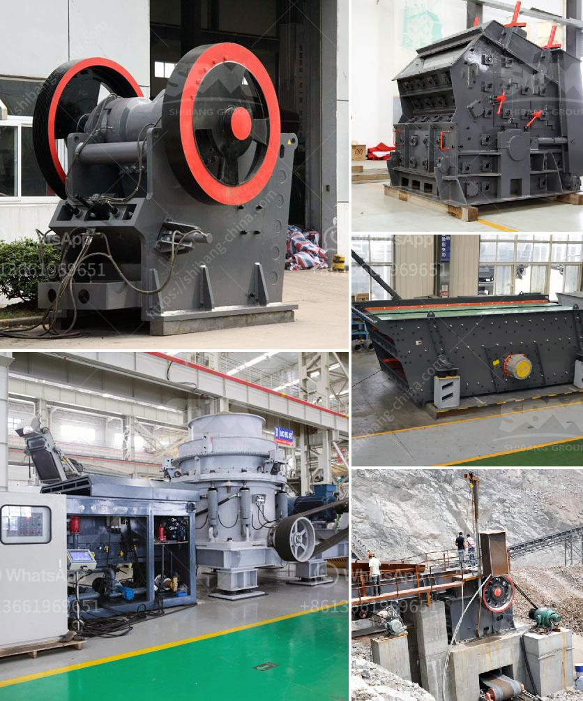

<h3>small bleaching powder manufacturing plant project report</h3>
A small bleaching powder manufacturing plant is a profitable and sustainable business venture that can be started with moderate capital investment. Bleaching powder is widely used for various purposes, including water treatment, disinfection, and laundry. This article will provide insights into the project report for a small bleaching powder manufacturing plant.

The executive summary gives an overview of the project, highlighting its objectives, estimated investment, expected profit, and payback period. It also outlines the business's unique selling proposition (USP) and target market.

The introduction section explains the importance of bleaching powder and its applications in different industries. It also discusses the market demand and potential growth opportunities, creating a context for the project.

This section focuses on analyzing the market size, growth rate, and potential competition. It includes information about the target market segments, their preferences, and requirements. The market analysis helps to identify the business's positioning and scope for expansion.

This section provides details about the manufacturing process, machinery, and equipment required to set up the small bleaching powder manufacturing plant. It also includes information about the production capacity, raw material sourcing, quality control measures, and compliance with regulatory standards.

The financial aspects section outlines the capital investment, operating costs, revenue projections, and profitability analysis. It includes a detailed break-even analysis and cash flow projections, enabling potential investors to assess the project's financial viability.

The operational plan describes the day-to-day activities involved in running the manufacturing plant. It covers aspects such as procurement, production, packaging, storage, and distribution. Additionally, it outlines the workforce requirements, training programs, and quality assurance measures.

This section focuses on the marketing and sales initiatives to promote the bleaching powder products. It includes a comprehensive marketing plan, target audience identification, distribution channels, pricing strategy, and promotional activities. A well-planned marketing and sales strategy is crucial for establishing a strong presence in the market.

Every business venture involves certain risks, and it is important to identify and mitigate them. The risk analysis section assesses potential challenges and provides a contingency plan. It also outlines the legal and environmental compliance requirements to ensure a sustainable and responsible operation.

The conclusion summarizes the potential of the small bleaching powder manufacturing plant project. It highlights its profitability, growth prospects, and contribution to the local economy. The conclusion emphasizes the significance of this venture as a sustainable business opportunity.

In conclusion, setting up a small bleaching powder manufacturing plant holds great potential for profitability and growth. The project report provides a comprehensive evaluation of the market demand, technical aspects, financial feasibility, operational plan, and marketing strategies. With appropriate planning and execution, this project can be a successful endeavor for entrepreneurs looking to establish a profitable business in the chemical manufacturing sector.
<h3>Contact us</h3><ul><li><strong>Whatsapp:&nbsp;<a href="https://wa.me/8613661969651">+8613661969651</a></strong></li><li><a href="https://swt.shibang-china.com/?git&amp;zhl&amp;small bleaching powder manufacturing plant project report"><strong>Online Service(chat now)</strong></a></li></ul><h3>Related</h3><ul><li><a href='mobile crushing machine for sale.md'>mobile crushing machine for sale</a></li><li><a href='hammer mills for rocks.md'>hammer mills for rocks</a></li><li><a href='mobile iron ore crusher.md'>mobile iron ore crusher</a></li><li><a href='cost of complete stone crushing plant in ghana.md'>cost of complete stone crushing plant in ghana</a></li><li><a href='clay brick making equipment south africa.md'>clay brick making equipment south africa</a></li></ul>