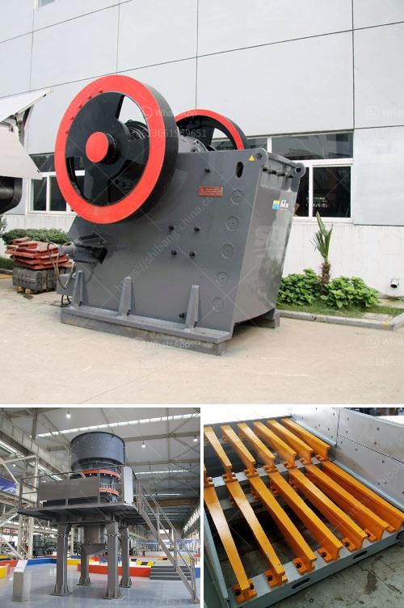

<h3>small cone crushers</h3>
The cone crusher is the most common type of mineral comminution machine used in crushing operations all around the world. Its versatility, durability, and easy maintenance make it a highly popular choice across many different industries. And when it comes to small and medium-sized enterprises (SMEs), small cone crushers are particularly indispensable.

One of the main advantages of small cone crushers is their compact size, which allows them to fit into tight spaces. This is especially beneficial for SMEs that often have limited space available in their production facilities. The small footprint of these crushers makes them a perfect solution for operations with space constraints or those looking to optimize their layout for increased efficiency.

Despite their smaller size, small cone crushers are capable of delivering high performance. They are designed to crush hard and abrasive materials effectively, providing a consistent and reliable output. This makes them suitable for a wide range of applications, from quarrying and mining to construction and recycling. SMEs can rely on small cone crushers to handle demanding tasks with ease while maintaining high levels of productivity.

Another factor that makes small cone crushers an excellent choice for SMEs is their affordability. These crushers are generally more cost-effective compared to larger models, making them a viable option for businesses with limited budgets. Additionally, their lower energy consumption translates into reduced operating costs, providing SMEs with long-term savings.

Furthermore, small cone crushers are relatively easy to maintain, requiring minimal downtime for regular maintenance tasks. This is especially important for SMEs, as any operational interruptions can have a significant impact on their productivity. With small cone crushers, maintenance and repairs can be carried out quickly, allowing businesses to maximize their uptime and minimize production losses.

In conclusion, small cone crushers offer a practical and cost-effective solution for SMEs in need of efficient crushing equipment. With their compact size, high performance, affordability, and easy maintenance, these crushers are designed to meet the needs of small and medium-sized enterprises, enabling them to increase their productivity while keeping operating costs to a minimum. Whether in quarrying, mining, construction, or recycling, SMEs can rely on small cone crushers to deliver reliable and consistent results in their operations.
<h3>Contact us</h3><ul><li><strong>Whatsapp:&nbsp;<a href="https://wa.me/8613661969651">+8613661969651</a></strong></li><li><a href="https://swt.shibang-china.com/?git&amp;zhl&amp;small cone crushers"><strong>Online Service(chat now)</strong></a></li></ul><h3>Related</h3><ul><li><a href='bentonite crushing machine.md'>bentonite crushing machine</a></li><li><a href='impact crusher sale.md'>impact crusher sale</a></li><li><a href='belt conveyor system manufacturers.md'>belt conveyor system manufacturers</a></li><li><a href='jaw crusher for hire south africa for limestone.md'>jaw crusher for hire south africa for limestone</a></li><li><a href='stone crusher accounting in tally.md'>stone crusher accounting in tally</a></li></ul>