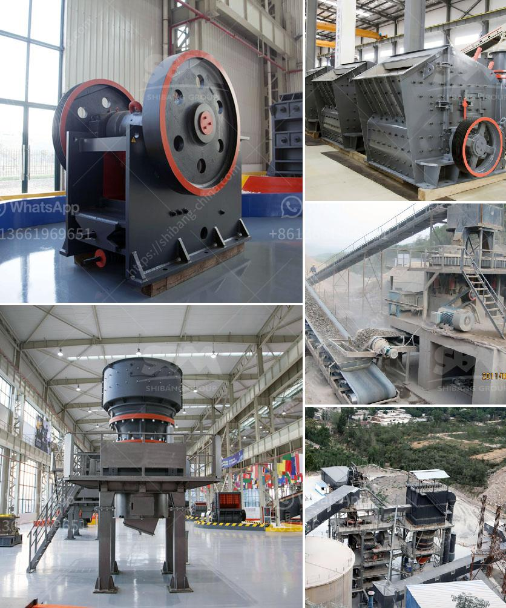

<h3>small diesel engine jaw crusher</h3>
Small diesel engine jaw crushers have various models and can crush materials with a compressive strength not exceeding 320MPa. The small jaw crusher can meet the production requirements of small-scale mining and gravel production lines. It can process materials with a particle size of less than 50mm and has a small footprint, low noise, and low energy consumption.

The small diesel engine jaw crusher is widely used in mining, metallurgy, building materials, roads, railways, water conservancy, and chemical industries. It has a simple structure, large crushing ratio, and high work efficiency. The small diesel engine jaw crusher is easy to operate and easy to maintain.

Compared with other crushers, the small diesel engine jaw crusher has the advantages of small size, simple structure, small footprint, and low cost. It can be used as a primary crusher or a secondary crusher. It can break various materials with a compressive strength not exceeding 320MPa.

When using the small diesel engine jaw crusher, users can adjust the discharge size through the adjustment device on the crusher. The crushed materials are discharged from the lower outlet of the crushing chamber. With the continuous rotation of the motor, the movable jaw of the crusher periodically crushes and discharges the materials, which achieves mass production.

In summary, the small diesel engine jaw crusher is a practical and cost-effective choice for small-scale gravel production lines and mining projects. It has the advantages of low noise, energy saving, convenient operation, and high work efficiency. With the development of mining technology, this crusher will play a more important role in the future.
<h3>Contact us</h3><ul><li><strong>Whatsapp:&nbsp;<a href="https://wa.me/8613661969651">+8613661969651</a></strong></li><li><a href="https://swt.shibang-china.com/?git&amp;zhl&amp;small diesel engine jaw crusher"><strong>Online Service(chat now)</strong></a></li></ul><h3>Related</h3><ul><li><a href='convaer belting company in durban.md'>convaer belting company in durban</a></li><li><a href='stoner cusher price in kenya.md'>stoner cusher price in kenya</a></li><li><a href='ultra fine grinding mill price.md'>ultra fine grinding mill price</a></li><li><a href='screen and crusher hire.md'>screen and crusher hire</a></li><li><a href='crushed price impact crusher price.md'>crushed price impact crusher price</a></li></ul>