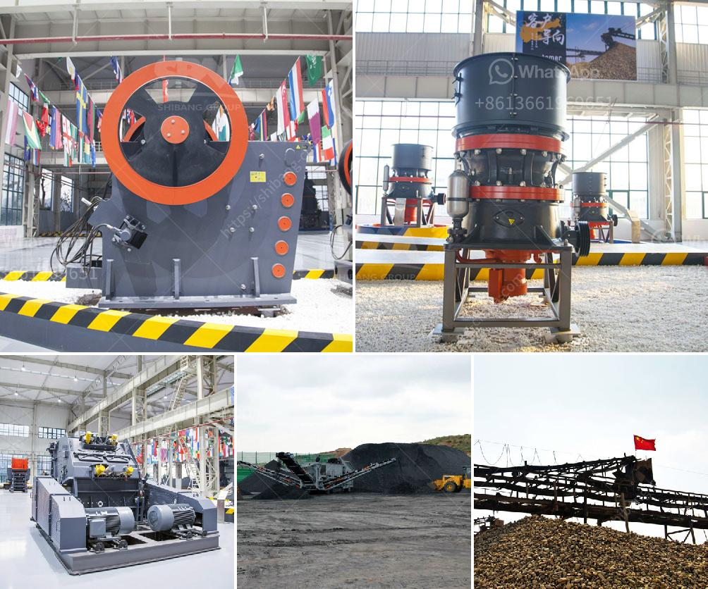

<h3>small gold mining plant in south africa</h3>
South Africa has always been known for its rich mineral resources, especially in gold. Since the discovery of gold in the late 19th century, the country has been a major producer and exporter of this precious metal. Small-scale mining plays a crucial role in South Africa's gold industry as it provides employment to a significant portion of the population, especially in rural areas.

One such small gold mining plant that has emerged in recent years is the artisanal mining plant. It is designed specifically for the small-scale miners who operate in remote and often challenging environments. These plants are typically smaller in size and have a lower production capacity compared to large-scale mining operations. However, they are highly efficient and cost-effective, making them a popular choice among small-scale miners.

The small gold mining plant utilizes various methods to extract gold from the ore, ensuring maximum yield and minimal wastage. These methods can include gravity separation, froth flotation, and carbon-in-leach processes. Each method is tailored to the specific characteristics of the ore, ensuring optimal recovery rates.

One of the key advantages of these small mining plants is that they are easily transportable and can be set up quickly in different locations. This flexibility allows the miners to move their operations to areas where gold deposits are more abundant, thereby maximizing their chances of success. Furthermore, the use of small-scale plants helps to reduce the environmental impact associated with large-scale mining operations.

Despite their small size, these artisanal mining plants make a significant contribution to South Africa's gold production. They provide employment opportunities, improve livelihoods, and contribute to local economic development. Moreover, they help to alleviate poverty and reduce dependency on informal mining activities, which often have negative environmental and social impacts.

In conclusion, the establishment of small-scale gold mining plants in South Africa has been beneficial for both the miners and the country's economy. These plants offer a sustainable solution for small-scale miners to earn a livelihood while minimizing their environmental footprint. As the demand for gold continues to grow, these small plants will continue to play a crucial role in the country's mining industry.
<h3>Contact us</h3><ul><li><strong>Whatsapp:&nbsp;<a href="https://wa.me/8613661969651">+8613661969651</a></strong></li><li><a href="https://swt.shibang-china.com/?git&amp;zhl&amp;small gold mining plant in south africa"><strong>Online Service(chat now)</strong></a></li></ul><h3>Related</h3><ul><li><a href='marble crusher supplier.md'>marble crusher supplier</a></li><li><a href='hammer mill for limestone in south africa.md'>hammer mill for limestone in south africa</a></li><li><a href='continuous ball mill for sale in malaysia.md'>continuous ball mill for sale in malaysia</a></li><li><a href='crusher price jaw crusher prices.md'>crusher price jaw crusher prices</a></li><li><a href='track crushing plant.md'>track crushing plant</a></li></ul>