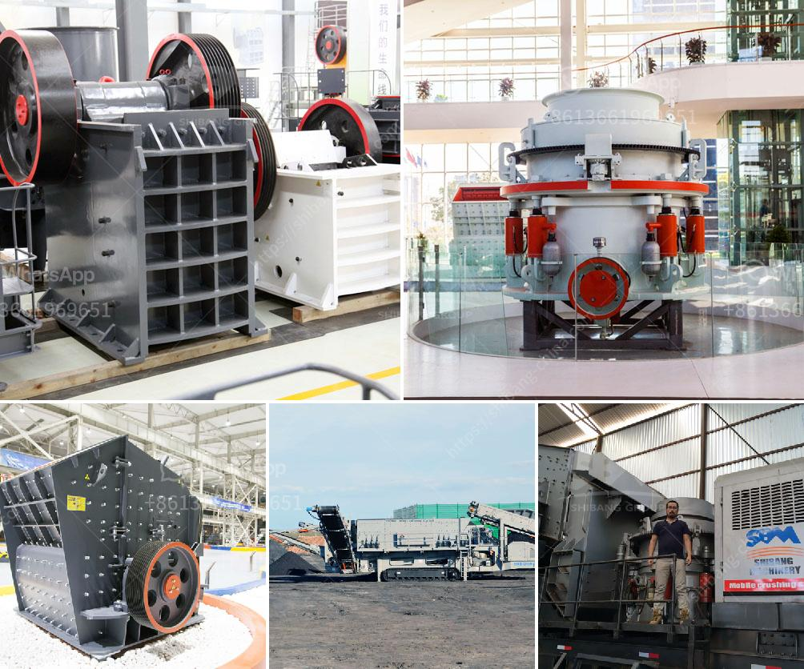

<h3>small gold wash plant for sale in canada</h3>
Are you a gold enthusiast looking to start your own mining operation? Or perhaps you already have experience in gold mining and want to expand your venture? Either way, a small gold wash plant can be an essential tool to help you separate gold nuggets from gravel, sand, or other sediments.

Canada, known for its rich mineral deposits, offers a great environment for gold mining enthusiasts. With various gold fields spread across the country, there are ample opportunities to strike it lucky. However, finding a reliable and efficient gold wash plant can be a challenging task. That's where small gold wash plants come into play.

A small gold wash plant refers to a piece of equipment that is specifically designed for gold mining operations. These plants can efficiently and effectively extract gold particles from gravel, sand, and other sediments. They are highly portable, meaning they can be easily transported to different gold mining sites. This flexibility allows miners to explore multiple locations and maximize their chances of finding gold.

One of the primary advantages of a small gold wash plant is its ability to process a large volume of material. These plants typically consist of a trommel or vibrating screen that is used to separate gold-bearing materials from the rest of the sediment. The screen has small holes, allowing fine-sized particles to fall through while larger pieces are retained.

Once the material is screened, it moves through a series of sluice boxes or riffles. These boxes use a combination of gravity and water to separate the gold from the sediment. Gold, being denser than other particles, tends to settle at the bottom of the sluice boxes, while lighter material is washed away.

In addition to their portability and high processing capacity, small gold wash plants are also relatively simple to operate. They require minimal maintenance and are designed to withstand the demanding conditions of gold mining. Many models are powered by diesel engines, making them suitable for remote locations without access to electricity.

When looking for a small gold wash plant in Canada, it's crucial to consider the reputable manufacturers and sellers. You want to ensure you are purchasing a reliable and durable piece of equipment that will last for years to come. Conduct thorough research, read reviews, and compare prices before making a purchase.

Another factor to consider is the cost of operating the wash plant. Besides the initial investment, you need to consider fuel costs, maintenance expenses, and the labor required to operate the plant. Take these factors into account to ensure the profitability of your gold mining operation.

In conclusion, a small gold wash plant is an essential tool for gold mining enthusiasts looking to maximize their chances of finding gold. Canada, with its vast gold fields, offers a great opportunity for aspiring miners. So, do your research, find a reputable supplier, and start your gold mining journey today!
<h3>Contact us</h3><ul><li><strong>Whatsapp:&nbsp;<a href="https://wa.me/8613661969651">+8613661969651</a></strong></li><li><a href="https://swt.shibang-china.com/?git&amp;zhl&amp;small gold wash plant for sale in canada"><strong>Online Service(chat now)</strong></a></li></ul><h3>Related</h3><ul><li><a href='ballast crushers alibaba.md'>ballast crushers alibaba</a></li><li><a href='used cement plant for sale germany.md'>used cement plant for sale germany</a></li><li><a href='grinding mill machine malaysia.md'>grinding mill machine malaysia</a></li><li><a href='grinding of limestone mill grinding.md'>grinding of limestone mill grinding</a></li><li><a href='turkish manufacturer belt conveyor.md'>turkish manufacturer belt conveyor</a></li></ul>