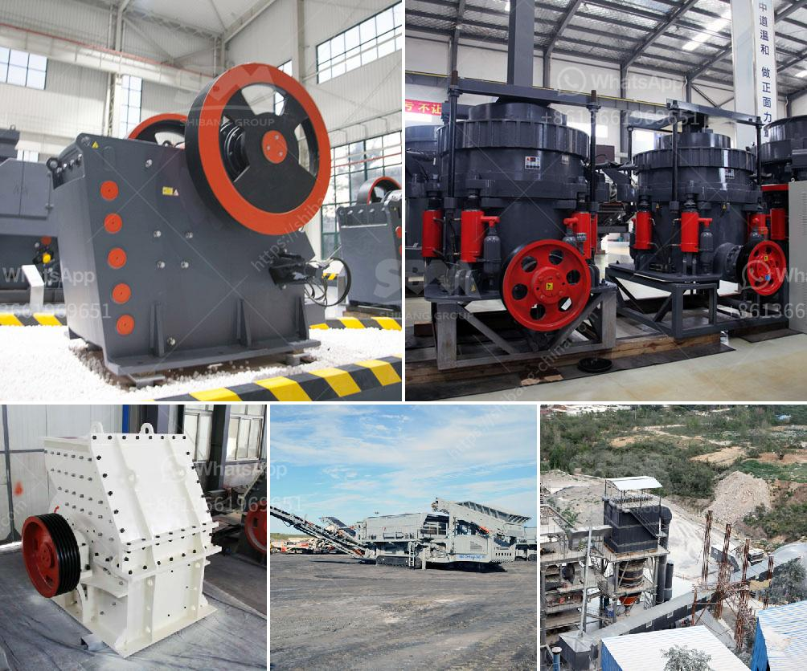

<h3>small grinding mill machine in india</h3>
Small grinding mill machines are used for processing various grains into fine powder or paste. These machines consist of a hopper, a milling chamber with rotating blades, a motor, and a control panel. The machines are compact and easy to operate, making them perfect for small-scale businesses in India.

One of the key advantages of using a small grinding mill machine is its versatility. It can process a wide range of grains such as wheat, rice, corn, and millet into different forms. With adjustable settings, users can choose the desired fineness of the output, catering to diverse culinary needs. This makes the machine suitable for both traditional and modern recipes.

The compact size of these machines is another great feature. They can be easily installed even in limited spaces, making them ideal for small businesses or home kitchens. Additionally, the machines are designed for efficient energy consumption, reducing operating costs and ensuring sustainability.

Not only are these machines practical, but they also offer a significant cost advantage. Compared to large-scale milling machines, small grinding mill machines are relatively inexpensive. This makes them affordable for small business owners and entrepreneurs who may have limited funds to invest in equipment.

Moreover, these machines are easy to maintain. Routine cleaning and simple maintenance tasks can be carried out by the user without the need for specialized skills or external support. This further adds to the convenience and cost-effectiveness of using small grinding mill machines in India.

In conclusion, small grinding mill machines in India are a valuable addition to any small-scale food processing business. They offer versatility, compactness, cost-effectiveness, and easy maintenance, making them an attractive choice for entrepreneurs. With the ability to process a variety of grains, these machines are an essential tool for enhancing product quality and expanding culinary possibilities.
<h3>Contact us</h3><ul><li><strong>Whatsapp:&nbsp;<a href="https://wa.me/8613661969651">+8613661969651</a></strong></li><li><a href="https://swt.shibang-china.com/?git&amp;zhl&amp;small grinding mill machine in india"><strong>Online Service(chat now)</strong></a></li></ul><h3>Related</h3><ul><li><a href='chrome ore processing plant price.md'>chrome ore processing plant price</a></li><li><a href='crushing roller mill japan.md'>crushing roller mill japan</a></li><li><a href='italia gypsum block making mechines.md'>italia gypsum block making mechines</a></li><li><a href='complete crusher plant for sale south africa.md'>complete crusher plant for sale south africa</a></li><li><a href='mining crusher for gold mining.md'>mining crusher for gold mining</a></li></ul>