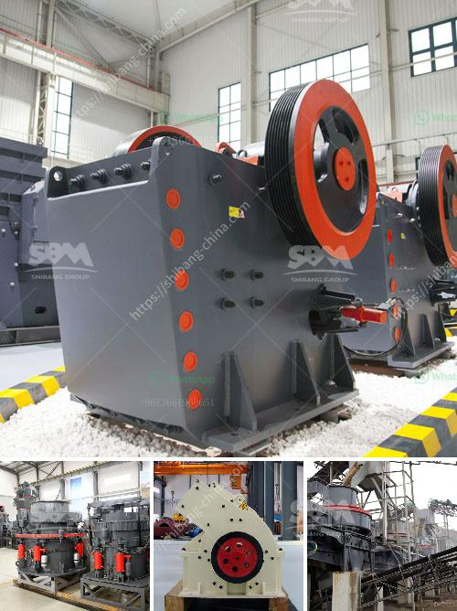

<h3>small impact crusher</h3>
The small impact crusher is a machine that crushes materials with a rotor, which rotates at a high speed and uses impact energy to crush materials. It is mainly used in industries such as cement, mining, metallurgy, and building materials. Due to its small size, convenient movement, and reliable performance, it has been widely used in domestic and foreign markets.

The small impact crusher has a simple structure, large crushing ratio, low energy consumption, high output, light weight, and cubic shape of the finished product. It is widely used in various ore crushing, railway, highway, energy, cement, chemical, construction, and other industries. The discharge particle size can be adjusted, which allows greater flexibility in the operation.

Compared to other crushing equipment, the small impact crusher has prominent advantages. First, it has a small size and is easy to move, which makes it suitable for narrow and complex workspaces. Second, it has a high production efficiency and can complete the crushing process once, without the need for secondary crushing. Third, it has a high degree of automation, which reduces labor costs and improves work efficiency.

The small impact crusher is durable and easy to maintain, with a long service life. It has a wide range of applications and can crush various materials such as limestone, granite, concrete, slag, and more. It is an ideal choice for secondary and tertiary crushing.

In conclusion, the small impact crusher is a versatile and efficient crushing equipment that can meet the needs of various industries. Its compact size and excellent performance make it a valuable asset in any project. For those looking for a reliable and efficient crusher, the small impact crusher is definitely worth considering.
<h3>Contact us</h3><ul><li><strong>Whatsapp:&nbsp;<a href="https://wa.me/8613661969651">+8613661969651</a></strong></li><li><a href="https://swt.shibang-china.com/?git&amp;zhl&amp;small impact crusher"><strong>Online Service(chat now)</strong></a></li></ul><h3>Related</h3><ul><li><a href='stone crusher machine in peru.md'>stone crusher machine in peru</a></li><li><a href='feldspar powder morbi.md'>feldspar powder morbi</a></li><li><a href='cement grinding machinery europe.md'>cement grinding machinery europe</a></li><li><a href='blake jaw crusher.md'>blake jaw crusher</a></li><li><a href='calculations for belt conveyor structural bents.md'>calculations for belt conveyor structural bents</a></li></ul>