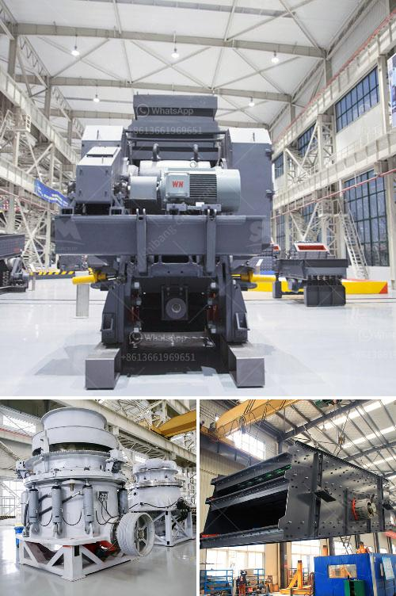

<h3>small mobile crusher feldspar</h3>
Feldspar is an often-used raw material applied in glassmaking, ceramics, and enamel production. However, the extraction and processing of feldspar can be challenging due to its abrasive nature and high hardness. To address this issue, the market offers a range of innovative solutions, including small mobile crushers specifically designed for feldspar crushing.

Traditional crushers, such as jaw crushers or impact crushers, can often fail to efficiently crush hard materials like feldspar due to their large size and high power consumption. Additionally, transporting them to the job site can be daunting. Small mobile crushers, on the other hand, provide a compact and energy-efficient solution that can be transported easily, saving time and effort.

The small mobile crushers for feldspar are equipped with a jaw crusher or impact crusher, as well as a vibrating feeder, belt conveyor, and vibrating screen. Thus, they complete the whole crushing process independently. Compared with large-scale stationary crushing plants, small mobile crushers have the following advantages:

1. Portability: Small mobile crushers are mounted on a wheeled or tracked chassis, allowing them to be easily transported to different job sites. This flexibility is especially beneficial for projects that require frequent relocation.

2. Space-saving design: The compact size of small mobile crushers allows them to fit into tight spaces, such as narrow construction sites or underground mining tunnels. This feature is particularly relevant in urban areas, where space is limited.

3. Energy efficiency: Small mobile crushers have smaller power requirements compared to their larger counterparts. Their small size and optimized design contribute to reduced power consumption, resulting in cost savings on fuel or electricity.

4. Versatility: Small mobile crushers can process a wide range of feldspar materials, from large blocks to fine powders. This versatility enables them to be used in various applications, such as construction, road building, mining, and recycling.

5. Reduced environmental impact: The compact size and energy-efficient operation of small mobile crushers make them more environmentally friendly compared to larger crushing plants. They produce less noise, dust, and emissions, making them a more sustainable choice for feldspar processing.

Despite their small size, these mobile crushers deliver high-quality results. They are equipped with powerful engines and cutting-edge crushing technology, ensuring efficient and reliable performance. Additionally, they can be customized to meet specific requirements, such as different output sizes or the addition of screening and conveying equipment.

In conclusion, small mobile crushers offer a practical and efficient solution for the extraction and processing of feldspar. Their portability, space-saving design, energy efficiency, versatility, and reduced environmental impact make them an excellent choice for various industries. Investing in a small mobile crusher for feldspar can yield long-term benefits, improving productivity, reducing operational costs, and contributing to a more sustainable future.
<h3>Contact us</h3><ul><li><strong>Whatsapp:&nbsp;<a href="https://wa.me/8613661969651">+8613661969651</a></strong></li><li><a href="https://swt.shibang-china.com/?git&amp;zhl&amp;small mobile crusher feldspar"><strong>Online Service(chat now)</strong></a></li></ul><h3>Related</h3><ul><li><a href='rollers for stone ball mills.md'>rollers for stone ball mills</a></li><li><a href='bentonite production plant machinery.md'>bentonite production plant machinery</a></li><li><a href='hand crank oyster shell crusher.md'>hand crank oyster shell crusher</a></li><li><a href='double toggle jaw crusher advantages.md'>double toggle jaw crusher advantages</a></li><li><a href='biggest cone crusher in africa.md'>biggest cone crusher in africa</a></li></ul>