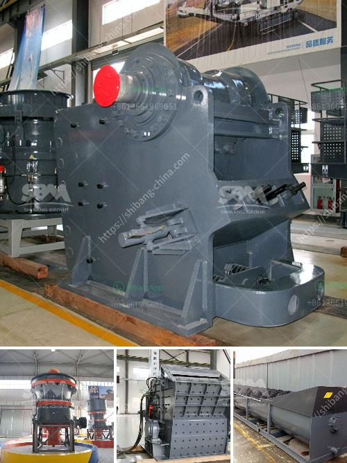

<h3>small mobile gold grinding mill in philippines</h3>
The Philippines, known for its rich mineral resources, has been a major player in the mining industry for centuries. With the increasing demand for gold, small-scale mining has become a thriving business in many remote areas across the country. To cater to this growing industry, small mobile gold grinding mills have become essential equipment for artisanal miners.

A mobile gold grinding mill is a unique and compact machine that requires only a small space to operate. This equipment is perfect for small-scale miners who cannot afford to invest in expensive machinery or have limited access to electricity. The mill is powered by a diesel engine, which makes it more versatile and suitable for remote areas with limited power supply.

The main function of the mobile gold grinding mill is to crush and grind ore into fine particles. This process is crucial in extracting gold from the ore since the precious metal is often embedded in hard rock. The grinding mill uses steel balls to pulverize the ore and release the gold particles. The finely ground ore is then mixed with water to create a slurry, which is further processed to extract gold through various techniques such as gravity separation and cyanidation.

Aside from its efficiency and portability, a small mobile gold grinding mill is also eco-friendly. Unlike traditional processing methods that involve the use of toxic chemicals, this equipment relies on mechanical forces to extract gold from the ore. This reduces the environmental impact and health hazards associated with conventional gold extraction processes.

Moreover, the use of small mobile gold grinding mills promotes inclusivity in the mining industry. It allows small-scale miners, who often operate informally, to increase their productivity and generate higher profits. These mills can be shared among groups of miners, enabling them to pool their resources and collectively benefit from the gold-rich areas they are working on.

In conclusion, small mobile gold grinding mills have proven to be a game-changer in the small-scale mining sector in the Philippines. With their efficiency, portability, and environmental friendliness, these mills have helped artisanal miners maximize their gold extraction capabilities. As the demand for gold continues to rise, these mobile grinding mills will undoubtedly play a vital role in ensuring a sustainable and responsible mining industry in the country.
<h3>Contact us</h3><ul><li><strong>Whatsapp:&nbsp;<a href="https://wa.me/8613661969651">+8613661969651</a></strong></li><li><a href="https://swt.shibang-china.com/?git&amp;zhl&amp;small mobile gold grinding mill in philippines"><strong>Online Service(chat now)</strong></a></li></ul><h3>Related</h3><ul><li><a href='aggregate crusher for sale in philippines.md'>aggregate crusher for sale in philippines</a></li><li><a href='cost of tph stage crushing plant.md'>cost of tph stage crushing plant</a></li><li><a href='coal mill manufacturer china.md'>coal mill manufacturer china</a></li><li><a href='bentonite grinding machines price.md'>bentonite grinding machines price</a></li><li><a href='stone crushing machine zimbabwe.md'>stone crushing machine zimbabwe</a></li></ul>