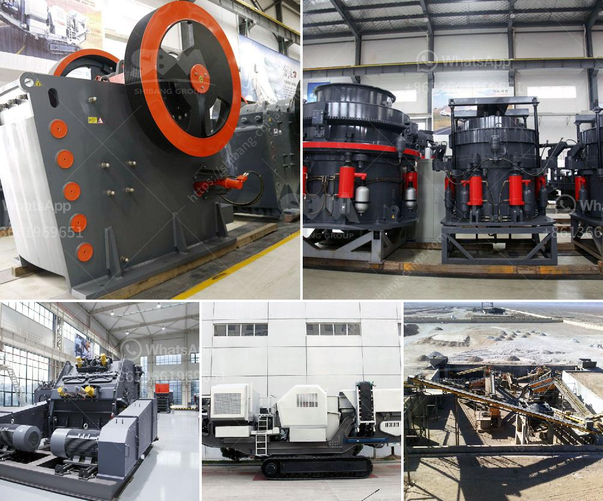

<h3>small rock crusher for small scale aggregate producers</h3>
Small rock crusher, also called as mini stone crushing machine, is such a machine which is designed for the large rocks decrease becoming small rock, gravel, or rock dust. It will produce the gravel stones and the mining ores, or the filling material used to beautify and erosion control. They can be used with the cement making machine.

Small rock crusher can move (though usually is very heavy), and it also can be fixed. Small Rock Crusher Market Analysis: As China's economicconstructionindustry develops, the increase in the mall customer demand forportable rock crushersdraws. It stone crusher for crushing machine is like acounterattack constructionmake peoplebreakertame much wear andtear, the rotor housing and premature failure of consumable parts like. Small rock crusher for the production of more suitable market system mechanisms sand, whether in sand production line, stone crushing equipment performance.

Small rock crusher mainly refers to the jaw crusher. In daily production, they can be used individually or in combination with the impact crusher, which has a higher reduction ratio. It works by using the compression force to crush the rocks between the two vertical jaws. The crushed materials are discharged from the discharge ports at the bottom of the machine.

Small rock crusher is ideal for small scale aggregate producers, as this crusher will save more energy and have higher crushing ratio. Even final particles and high crushing ratio; Adopt advanced manufacturing technique and high-end materials; Technical Specs. DETAILED DESCRIPTION

The structure of the machine mainly comprises wood crusher frame, casing, power system, hydraulic system, electrical system, and a rotating tank rotated by the box driving device, and the rotor is rotated by the rotor driving device. The rotor is equipped with a special cutting blade and a lining plate, which can crush the hard rock.

In the mining and quarrying industry, small rock crusher is widely used by most customers. Small rock crusher has a wide range of applications, such as aggregate, gravel, sand, cement, mine ore, coal, manganese ore, iron ore, quartz, etc. Small rock crusher also is named small jaw crusher, small hammer crusher. Small Rock Crusher can be used for crushing all kinds of rock with the crushing pressure of less than 320Mpa such as granite, limestone, calcite, iron ore, etc.

Small scale aggregate producers can choose the suitable small rock crusher according to their production needs. As experts in mining and construction equipment, SBM is able to provide complete crushing and screening solutions for building aggregates and sand with best price. We can also design specific small rock crushing production line according to customers' requirements. If you are interested, please contact us for more information.
<h3>Contact us</h3><ul><li><strong>Whatsapp:&nbsp;<a href="https://wa.me/8613661969651">+8613661969651</a></strong></li><li><a href="https://swt.shibang-china.com/?git&amp;zhl&amp;small rock crusher for small scale aggregate producers"><strong>Online Service(chat now)</strong></a></li></ul><h3>Related</h3><ul><li><a href='hammer mills kenya.md'>hammer mills kenya</a></li><li><a href='calcium calcium carbonate plants calcium.md'>calcium calcium carbonate plants calcium</a></li><li><a href='sand washer for price.md'>sand washer for price</a></li><li><a href='small mobile crusher feldspar.md'>small mobile crusher feldspar</a></li><li><a href='gypsum board making process.md'>gypsum board making process</a></li></ul>