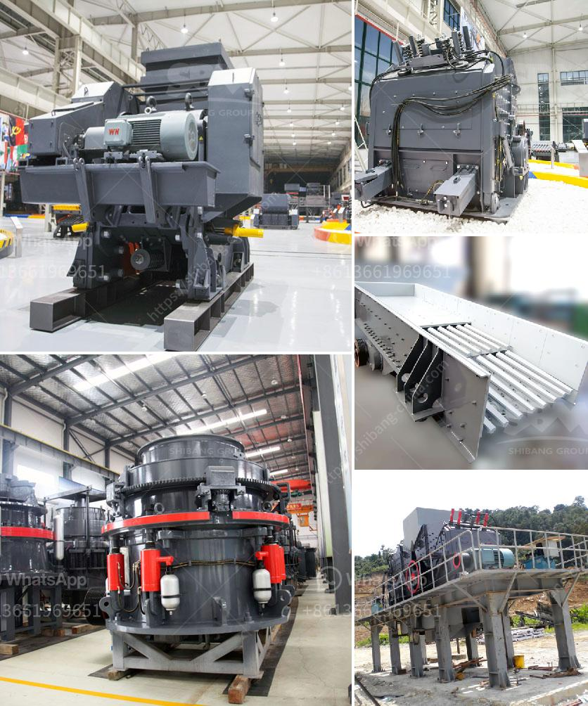

<h3>small sacle crushers in zambia</h3>
Zambia is one of the countries in Africa that has been blessed with abundant natural resources, including minerals such as copper, cobalt, and emeralds. These resources have made mining a crucial sector that contributes significantly to the country's economy. However, with the increase in mining activities, there is a corresponding increase in the generation of waste materials, such as rocks and stones. Addressing this waste management challenge is where small-scale crushers come in.

Small-scale crushers are machines designed to reduce the size of rocks and stones in a localized manner. These machines are crucial in the mining sector as they enable miners to extract valuable minerals from the waste rock, which would otherwise go to waste. By reducing the waste material, small-scale crushers make mining operations more efficient and sustainable.

One of the primary advantages of small-scale crushers is their affordability and accessibility to small-scale miners in Zambia. These machines are designed to be simple and easy to operate, making them ideal for individuals or small groups involved in mining activities. Moreover, they are often portable and can be easily moved to different mining sites. This flexibility ensures that the crushers can be used where they are needed the most.

Furthermore, small-scale crushers contribute to local job creation. As they are easy to operate and require minimal maintenance, they can be operated by locals with basic training. By employing local people, these crushers help to stimulate local economies and reduce unemployment rates.

In addition to their economic benefits, small-scale crushers also have positive environmental impacts. By crushing and reducing the waste material, these machines help in the efficient utilization of resources. They also minimize the need for large mining pits and reduce the environmental footprint left by mining activities.

Despite their numerous advantages, it is crucial to note that small-scale crushers should be used responsibly and in compliance with local regulations. It is essential to ensure that these machines are operated safely and in an environmentally-friendly manner.

In conclusion, small-scale crushers play a vital role in Zambia's mining sector. Their affordability, accessibility, and positive impacts on job creation and the environment make them an essential tool for sustainable development. By investing in and promoting the use of small-scale crushers, Zambia can witness improved waste management, resource utilization, and overall economic growth in the mining sector.
<h3>Contact us</h3><ul><li><strong>Whatsapp:&nbsp;<a href="https://wa.me/8613661969651">+8613661969651</a></strong></li><li><a href="https://swt.shibang-china.com/?git&amp;zhl&amp;small sacle crushers in zambia"><strong>Online Service(chat now)</strong></a></li></ul><h3>Related</h3><ul><li><a href='crawler type mobile crushers.md'>crawler type mobile crushers</a></li><li><a href='how to manufacture jaw crusher.md'>how to manufacture jaw crusher</a></li><li><a href='crusher for silica.md'>crusher for silica</a></li><li><a href='convaer belting company in durban.md'>convaer belting company in durban</a></li><li><a href='complete mobile stone crushing machine.md'>complete mobile stone crushing machine</a></li></ul>