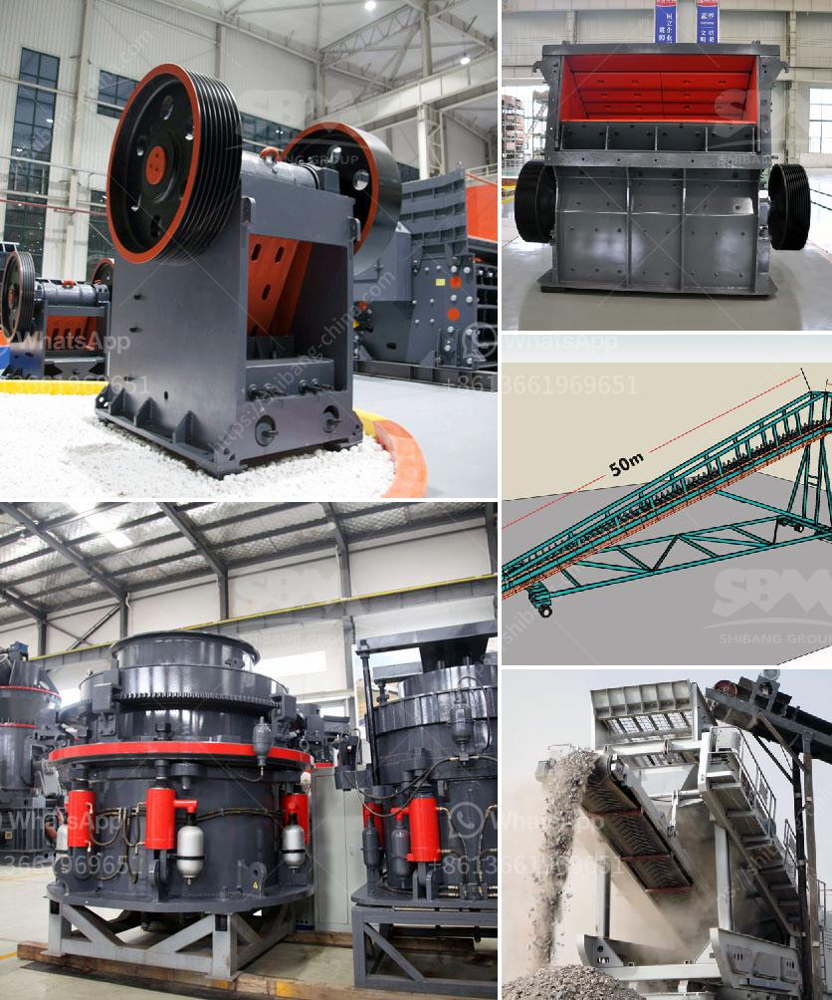

<h3>small scale electric arc ferrochrome smelting</h3>
The steel industry has long been striving for innovative and sustainable methods of producing high-quality alloys. Small scale electric arc ferrochrome smelting, a relatively recent development, has emerged as a gamechanger in this endeavor. This advanced technology utilizes electric arc furnaces to convert chrome ore into ferrochrome, a vital ingredient in stainless steel production. With its numerous benefits, this small-scale method is rapidly gaining popularity among steel manufacturers worldwide.

Traditionally, the production of ferrochrome involves large-scale smelting facilities that require massive investments, energy-intensive processes, and a significant carbon footprint. However, small scale electric arc ferrochrome smelting offers an impressive alternative that overcomes these drawbacks. By downsizing the smelting facilities, manufacturers can reduce capital costs significantly. This affordability makes ferrochrome production accessible to a broader range of industries, including small and medium-sized enterprises (SMEs). Additionally, the reduced energy consumption of these smaller furnaces compared to conventional methods leads to lower carbon emissions, contributing to a greener future.

Another noteworthy advantage of small scale electric arc ferrochrome smelting is its flexibility and adaptability. With bigger smelting plants, the fixed infrastructure often restricts changes in production according to market demands. In contrast, small-scale facilities can be easily modified or expanded to meet varying requirements. This inherent versatility allows manufacturers to produce different grades of ferrochrome, catering to the specific needs of customers. As a result, steel industries can enhance their production capabilities, maintain a competitive edge, and swiftly respond to changing market trends.

The small-scale electric arc ferrochrome smelting process also ensures improved operational efficiency. With advanced automation and control systems, it is easier to monitor and regulate the smelting conditions, resulting in consistent output quality. Additionally, the reduced furnace size leads to faster heating and cooling cycles, minimizing the production time and accelerating the overall manufacturing process. This efficiency translates into cost savings and higher productivity for steel manufacturers.

Moreover, environmental considerations play a pivotal role in the transition towards this small-scale smelting method. The ecology-conscious approach of electric arc furnaces significantly reduces the environmental impact. Unlike traditional methods that produce hazardous gases and generate large amounts of waste slag, small scale electric arc furnaces utilize cleaner energy sources and generate fewer emissions. The ability to recycle and reuse waste materials further contributes to conservation efforts. This enhanced sustainability aligns with the global push towards greener manufacturing practices and ensures a more sustainable steel industry.

In conclusion, small scale electric arc ferrochrome smelting emerges as a transformative technology, revolutionizing the steel industry. This advanced method offers an affordable, flexible, and sustainable alternative to conventional smelting practices. With its reduced carbon footprint, operational efficiency, and adaptability, it holds immense potential for steel manufacturers of all sizes. As more companies adopt this gamechanging process, the global steel industry evolves into a cleaner, more efficient, and sustainable sector.
<h3>Contact us</h3><ul><li><strong>Whatsapp:&nbsp;<a href="https://wa.me/8613661969651">+8613661969651</a></strong></li><li><a href="https://swt.shibang-china.com/?git&amp;zhl&amp;small scale electric arc ferrochrome smelting"><strong>Online Service(chat now)</strong></a></li></ul><h3>Related</h3><ul><li><a href='mobile iron ore crusher.md'>mobile iron ore crusher</a></li><li><a href='kenya sellers of used stone crushers.md'>kenya sellers of used stone crushers</a></li><li><a href='kaolin separate beneficiation of iron.md'>kaolin separate beneficiation of iron</a></li><li><a href='gypsum crusher manufacturing in odisha.md'>gypsum crusher manufacturing in odisha</a></li><li><a href='mobile crusher for sale in south africa.md'>mobile crusher for sale in south africa</a></li></ul>