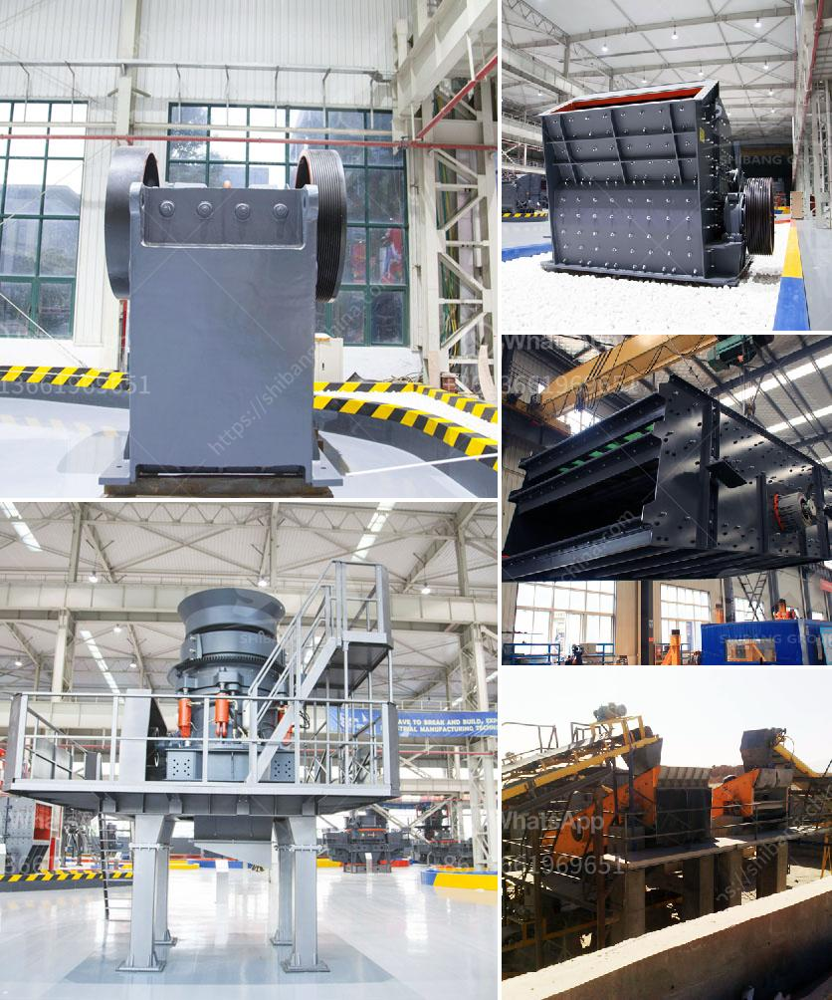

<h3>small scale gold ball mill</h3>
Gold is a precious metal renowned for its value and beauty. It is used not only in the creation of jewelry and decorative items but also in various industries such as medicine, electronics, and dentistry. Gold mining is a global industry that can occur in many different countries and regions, often in remote areas where large-scale mining operations may not be feasible. In such cases, small-scale mining becomes the main method of extracting gold, and therefore, the need for small-scale gold ball mills.

A small-scale gold ball mill serves as the primary tool for grinding ore into fine particles. It is used to liberate gold particles from the surrounding rock and other materials. It is a crucial step in the beneficiation process, as it prepares the ore for further processing and helps separate gold particles from other minerals that would otherwise be unprofitable.

As the name suggests, a small-scale gold ball mill is a piece of heavy-duty equipment designed to grind gold-bearing ore to a fine size. These ball mills are generally used for single-stage fine grinding, regrinding, and as the second stage in two-stage grinding circuits. According to the need of customers, ball mills can be either wet or dry designs. The grinding mill can be equipped with different types of lining boards and grinding media, such as steel balls, ceramic balls, or even natural pebbles.

One of the key advantages of a small-scale gold ball mill is its versatility. It can be used for both wet and dry grinding, making it suitable for a wide range of applications. Moreover, it requires relatively low power consumption, making it energy-efficient and cost-effective.

Another advantage of a small-scale gold ball mill is its portability. It is compact and can be easily transported to different mining sites. This allows miners to set up temporary mills in remote areas where access to electricity or infrastructure may be limited. Portable mills can be powered by generators or solar panels, offering flexibility and independence to small-scale miners.

The operation of a small-scale gold ball mill is relatively simple. The ore is fed into the mill, either from the mine shaft or through a hopper. The ore is then ground by steel balls or natural pebbles inside the mill, resulting in the liberation of gold particles. The ground ore is then screened to separate the oversized particles, which are returned to the mill for further grinding, from the finely ground gold particles, which are collected in tanks or troughs.

In conclusion, a small-scale gold ball mill is a versatile and cost-effective tool for grinding gold-bearing ore. It can be used for wet or dry grinding, making it suitable for a wide range of applications. It is also portable and can be easily transported to different mining sites, allowing small-scale miners to access gold deposits in remote areas. With its simplicity and effectiveness, the small-scale gold ball mill plays a crucial role in the gold mining industry.
<h3>Contact us</h3><ul><li><strong>Whatsapp:&nbsp;<a href="https://wa.me/8613661969651">+8613661969651</a></strong></li><li><a href="https://swt.shibang-china.com/?git&amp;zhl&amp;small scale gold ball mill"><strong>Online Service(chat now)</strong></a></li></ul><h3>Related</h3><ul><li><a href='hammer mill south africa.md'>hammer mill south africa</a></li><li><a href='types of coal crusher used in industry.md'>types of coal crusher used in industry</a></li><li><a href='iron ore crusher plant.md'>iron ore crusher plant</a></li><li><a href='barit mineral processing and extractive malaysia.md'>barit mineral processing and extractive malaysia</a></li><li><a href='stone crusher in uganda.md'>stone crusher in uganda</a></li></ul>