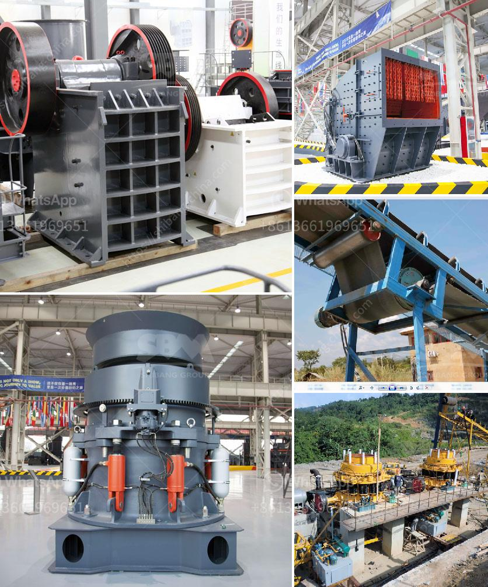

<h3>small scale gold mining equipment for sale auction</h3>
Gold has captivated humanity for centuries, with its unmistakable gleam and enduring value. Small-scale gold mining has long been a vital source of income for individuals and communities worldwide, providing an opportunity for both economic growth and social development. As this industry continues to prosper, the demand for reliable and efficient mining equipment is on the rise. This article delves into the allure of gold mining equipment auctions, where small-scale miners can find quality machinery at competitive prices.

Small-scale gold mining plays a crucial role in the global gold supply chain, accounting for approximately 20% of the world's gold production. This sector offers numerous economic benefits, especially for developing countries, where it provides employment, income generation, and contributes to local economies. With the right equipment, small-scale miners can efficiently extract gold from deposits, ensuring a sustainable livelihood.

Auctions present an exciting opportunity for small-scale gold miners to acquire high-quality equipment at reduced costs. Traditionally, these auctions were limited to large-scale mining companies, but with the advent of online platforms, access to these auctions has become increasingly democratized. These platforms bring together a wide range of mining equipment, including excavators, crushers, washers, and concentrators, all up for competitive bidding.

One of the significant advantages of purchasing equipment through auctions is the potential cost savings. As mining companies upgrade their equipment or cease operations, well-maintained machinery is often put up for auction. This creates a win-win situation, where sellers can recoup some of their investment, while buyers benefit from acquiring high-quality equipment at a fraction of its original cost.

Moreover, auctions allow small-scale miners to find specialized equipment that meets their specific needs, such as small-scale crushers or gravity concentrators. These unique machines are designed to optimize gold recovery and minimize waste, helping miners maximize their profits. By participating in an auction, they gain access to a diverse range of equipment options, tailored to suit their operational requirements perfectly.

While auctions offer numerous opportunities, it is essential for miners to exercise caution and conduct thorough research before purchasing any equipment. To ensure a successful purchase, it's vital to inspect the condition, maintenance records, and specifications of the machinery listed. Additionally, understanding the value and market price of similar equipment is beneficial in determining a reasonable bidding strategy.

Small-scale gold mining continues to open doors to economic empowerment and progress. The availability of affordable and efficient mining equipment plays a pivotal role in the success of these endeavors. Through auctions, small-scale miners gain access to high-quality machinery that enhances productivity and maximizes gold recovery, ensuring a sustainable and profitable future. With careful planning and adequate research, miners can seize the opportunities provided by gold mining equipment auctions and pave their way to success in this lucrative industry.
<h3>Contact us</h3><ul><li><strong>Whatsapp:&nbsp;<a href="https://wa.me/8613661969651">+8613661969651</a></strong></li><li><a href="https://swt.shibang-china.com/?git&amp;zhl&amp;small scale gold mining equipment for sale auction"><strong>Online Service(chat now)</strong></a></li></ul><h3>Related</h3><ul><li><a href='china raymond roller mills.md'>china raymond roller mills</a></li><li><a href='conveyor belt manufacturing plant crushers equipment.md'>conveyor belt manufacturing plant crushers equipment</a></li><li><a href='stone crusher rotary screen in karnataka.md'>stone crusher rotary screen in karnataka</a></li><li><a href='large scale gold mining equipment for sale.md'>large scale gold mining equipment for sale</a></li><li><a href='gold mining equipments manufacturers in denmark.md'>gold mining equipments manufacturers in denmark</a></li></ul>