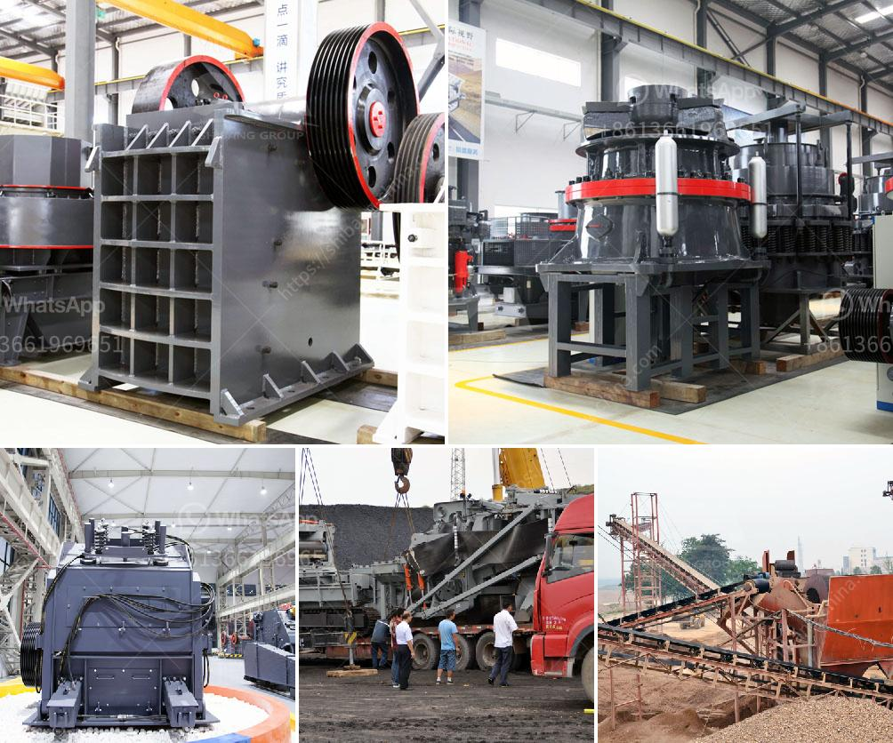

<h3>small scale gypsum powder plant</h3>
A small scale gypsum powder plant is an ideal investment opportunity for new entrepreneurs that are looking to establish themselves in the gypsum market. The small scale gypsum powder plant is capable of producing 5 to 30 tons of gypsum powder per hour, which is ideal for small scale production requirements.

Gypsum is a versatile and widely used material in various industries such as construction, agriculture, and pharmaceuticals. Its diverse range of applications makes gypsum an essential component in many products. Therefore, investing in a small scale gypsum powder plant is a smart choice for entrepreneurs seeking to tap into this lucrative market.

The process of manufacturing gypsum powder in a small scale plant involves drying gypsum rock, crushing it into a fine powder, calcining the powder, and packaging the final product. The resulting gypsum powder is a pure white material that is highly sought after in the market due to its high purity and superior quality.

One of the main advantages of a small scale gypsum powder plant is its low initial investment. Compared to large scale production facilities, a small scale plant requires smaller machinery and infrastructure, significantly reducing the cost of setting up the plant. Additionally, the operational costs of a small scale plant are also relatively low, making it an attractive investment option with high return potential.

Another advantage of a small scale gypsum powder plant is its flexibility. With a small scale production facility, entrepreneurs have the opportunity to test and explore different product variations and tailor their production to meet specific customer demands. This flexibility allows entrepreneurs to adapt quickly to market dynamics and seize emerging opportunities.

Furthermore, a small scale gypsum powder plant allows entrepreneurs to establish strong relationships with local suppliers and customers. This can be advantageous in terms of cost savings and customer loyalty. By sourcing raw materials from local suppliers, entrepreneurs can reduce transportation costs and support local businesses. Additionally, having a local manufacturing facility allows entrepreneurs to offer competitive pricing and quick delivery to customers, further improving customer satisfaction and loyalty.

In conclusion, investing in a small scale gypsum powder plant is a great opportunity for new entrepreneurs looking to enter the gypsum market. The low initial investment, flexibility, and potential for strong relationships with suppliers and customers make this investment option highly attractive. With the increasing demand for gypsum products in various industries, a small scale gypsum powder plant has excellent market potential and can provide sustainable returns on investment.
<h3>Contact us</h3><ul><li><strong>Whatsapp:&nbsp;<a href="https://wa.me/8613661969651">+8613661969651</a></strong></li><li><a href="https://swt.shibang-china.com/?git&amp;zhl&amp;small scale gypsum powder plant"><strong>Online Service(chat now)</strong></a></li></ul><h3>Related</h3><ul><li><a href='buy new bal mill.md'>buy new bal mill</a></li><li><a href='stone crushing machines in canada.md'>stone crushing machines in canada</a></li><li><a href='were to buy old rock crusher.md'>were to buy old rock crusher</a></li><li><a href='density of crushed hornfels basalt granite.md'>density of crushed hornfels basalt granite</a></li><li><a href='mobile cone crusher zenith.md'>mobile cone crusher zenith</a></li></ul>