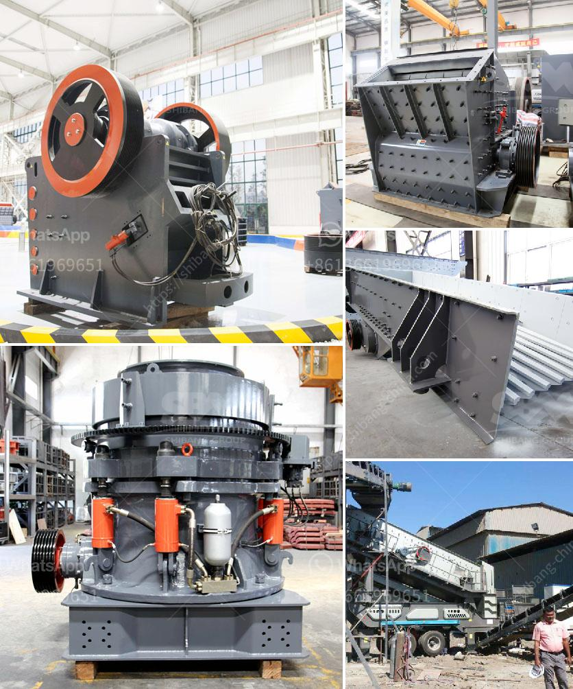

<h3>small scale sand washer machines</h3>
In various industries such as construction, mining, and manufacturing, the use of sand is essential. However, before it can be used in the desired application, sand needs to be cleaned and free from impurities. The manual labor required for this task can be time-consuming and inefficient. That is where small-scale sand washer machines come into play. These machines offer a convenient and effective solution to clean sand quickly, ensuring a high-quality end product.

Small-scale sand washer machines are compact and portable, making them suitable for smaller operations or sites with limited space. They are designed to remove dirt, dust, and other contaminants from the sand, improving its quality and usability. With their powerful cleaning capabilities, these machines can save time and effort, resulting in increased productivity and efficiency.

One of the key features of small-scale sand washer machines is their ability to handle a wide range of sand types and sizes. Whether it's fine sand or coarse sand, these machines can effectively clean and separate the particles, leaving behind only clean and usable sand. This versatility makes them suitable for a variety of applications, from construction projects to sandblasting operations.

Another advantage of small-scale sand washer machines is their user-friendly operation. They are designed to be easy to use with straightforward controls and settings. Most machines come with adjustable water flow and pressure, allowing operators to customize the cleaning process according to their specific needs. Additionally, they are equipped with durable brushes or paddles that agitate the sand, ensuring thorough cleaning.

Furthermore, small-scale sand washer machines are designed with durability and longevity in mind. They are constructed using high-quality materials that can withstand the harsh conditions typically encountered in sand cleaning operations. These machines are equipped with corrosion-resistant components, ensuring their reliable performance even in environments with high levels of moisture or saltwater.

When it comes to maintenance, small-scale sand washer machines are relatively easy to upkeep. Regularly cleaning the machine and performing basic maintenance tasks, such as checking and replacing worn-out parts, will help prolong its lifespan and ensure consistent performance. Manufacturers often provide user manuals and guidelines to assist operators in maintaining the machines properly.

In conclusion, small-scale sand washer machines offer a practical and efficient solution for cleaning sand in various industries. Their compact size, versatility, and user-friendly operation make them an invaluable tool for any operation that requires clean and high-quality sand. By investing in these machines, businesses can save time, improve productivity, and deliver superior end products. Whether it's for construction, manufacturing, or other applications, small-scale sand washer machines are a reliable and cost-effective choice.
<h3>Contact us</h3><ul><li><strong>Whatsapp:&nbsp;<a href="https://wa.me/8613661969651">+8613661969651</a></strong></li><li><a href="https://swt.shibang-china.com/?git&amp;zhl&amp;small scale sand washer machines"><strong>Online Service(chat now)</strong></a></li></ul><h3>Related</h3><ul><li><a href='small mobile gold grinding mill in philippines.md'>small mobile gold grinding mill in philippines</a></li><li><a href='crusher and screening plant.md'>crusher and screening plant</a></li><li><a href='crawler type mobile crushers.md'>crawler type mobile crushers</a></li><li><a href='crusher machine for unit.md'>crusher machine for unit</a></li><li><a href='calculations for belt conveyor structural bents.md'>calculations for belt conveyor structural bents</a></li></ul>