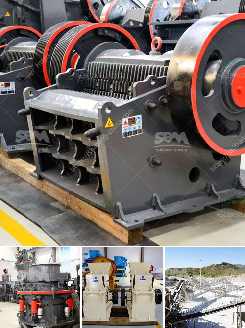

<h3>small sized cement plant project cost in india</h3>
Cement is a key sector in India's economic growth. With the increasing demand for cement in the construction industry, the need for small-sized cement plants is on the rise. These mini cement plants are specifically designed to cater to the demands of local construction projects and offer a more sustainable and cost-effective solution.

Setting up a small-sized cement plant in India requires thorough planning and proper execution. Here, we will discuss the project cost and financial aspects associated with establishing a mini cement plant.

The cost of a small-sized cement plant in India varies depending on factors such as the location, scale of operation, project-specific requirements, and market conditions. Typically, the project cost involves three major investment components - land and building, plant and machinery, and working capital.

The first step in setting up a mini cement plant is acquiring suitable land and constructing the necessary buildings. The cost of land can vary significantly depending on the location and availability. It is suggested to choose a location near the target market to reduce transportation costs. A 1-acre land can cost around INR 6-10 million (USD 80,000-130,000), including registration and legal expenses. The construction of the plant building and office premises can cost around INR 4-6 million (USD 55,000-80,000) on average.

The next major expense is the procurement of plant and machinery required for cement production. The machinery includes crushers, mills, separators, fans, conveyors, etc. The cost of machinery depends on the capacity of the plant. For a small-sized cement plant with a production capacity of 50-100 tons per day, the machinery cost can be around INR 5-7 million (USD 70,000-100,000). However, it is recommended to get detailed quotations from equipment manufacturers for accurate cost estimation.

Apart from the initial capital investment, working capital is necessary to cover operational expenses until the plant reaches its break-even point. It includes raw material procurement, salaries, utilities, marketing, maintenance, and administrative expenses. The working capital requirement can vary depending on the scale of the operation. Typically, a small-sized cement plant in India may need working capital of around INR 2-5 million (USD 30,000-70,000) for initial months.

Additionally, it is crucial to consider other expenses like licensing and permits, project feasibility study, human resources, marketing, and promotional activities. These costs can add up to the overall project expenses.

To finance a small-sized cement plant project in India, entrepreneurs can explore various funding options like bank loans, venture capital, private equity, or government subsidies and schemes. It is recommended to prepare a comprehensive business plan and financial projections to attract investors or secure bank loans.

In conclusion, establishing a small-sized cement plant in India requires careful planning, considering factors like project location, machinery requirement, initial capital investment, and working capital. While the cost can vary depending on specific project conditions, the average project cost for a small-sized cement plant can range from INR 15-25 million (USD 200,000-350,000). With proper execution and efficient operations, such a project can be a promising endeavor in the growing Indian cement sector.
<h3>Contact us</h3><ul><li><strong>Whatsapp:&nbsp;<a href="https://wa.me/8613661969651">+8613661969651</a></strong></li><li><a href="https://swt.shibang-china.com/?git&amp;zhl&amp;small sized cement plant project cost in india"><strong>Online Service(chat now)</strong></a></li></ul><h3>Related</h3><ul><li><a href='clinker grinding plant.md'>clinker grinding plant</a></li><li><a href='granite quarry machinery for sale.md'>granite quarry machinery for sale</a></li><li><a href='crusher machine manufacturers.md'>crusher machine manufacturers</a></li><li><a href='100tph stone crusher.md'>100tph stone crusher</a></li><li><a href='jaw crushers 100tph.md'>jaw crushers 100tph</a></li></ul>