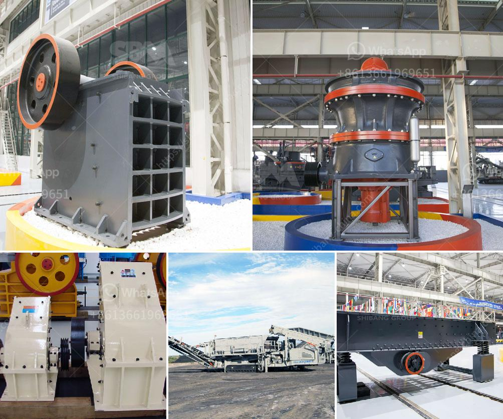

<h3>small stone crushers</h3>
Small stone crushers are designed to handle a wide range of materials with a relatively low investment cost. They are usually used in construction sites, quarries, and other applications where large stones need to be reduced in size.

One of the primary advantages of these machines is their compact size. Unlike larger crushers, small stone crushers can be easily transported and installed in a matter of hours. This makes them ideal for small-scale operations or places with limited space. Additionally, their compact design also allows for easy maintenance and repairs.

Despite their small size, these crushers are highly efficient in breaking down stones into smaller sizes. They are usually equipped with powerful motors and high-quality components that ensure maximum productivity and durability. These crushers can handle various types of stones, including limestone, granite, basalt, river pebbles, etc.

Another advantage of small stone crushers is their versatility. They can be used for both primary and secondary crushing, depending on the application. This means that one machine can perform multiple functions, reducing the need for additional equipment. Furthermore, these crushers can be adjusted to produce different sizes of crushed stones, making them suitable for various construction projects.

In terms of cost, small stone crushers are relatively affordable. They are available at a fraction of the price of larger crushers, making them accessible to smaller businesses and individuals. Additionally, their low operating costs and high efficiency result in significant savings in the long run.

In conclusion, small stone crushers are versatile, efficient, and cost-effective machines that can effectively crush stones in various applications. Their compact size and easy installation make them suitable for small-scale operations, while their high productivity and low maintenance requirements ensure maximum profitability. Whether it's for a construction site, quarry, or other projects, small stone crushers are a valuable asset in any operation.
<h3>Contact us</h3><ul><li><strong>Whatsapp:&nbsp;<a href="https://wa.me/8613661969651">+8613661969651</a></strong></li><li><a href="https://swt.shibang-china.com/?git&amp;zhl&amp;small stone crushers"><strong>Online Service(chat now)</strong></a></li></ul><h3>Related</h3><ul><li><a href='calcium carbonate powder crusher origin usa.md'>calcium carbonate powder crusher origin usa</a></li><li><a href='cara pemasangan belt conveyor.md'>cara pemasangan belt conveyor</a></li><li><a href='manufacturers small concrete brokmachine bangkok.md'>manufacturers small concrete brokmachine bangkok</a></li><li><a href='how to make a talcum powder.md'>how to make a talcum powder</a></li><li><a href='frac sand mine feasibility study.md'>frac sand mine feasibility study</a></li></ul>