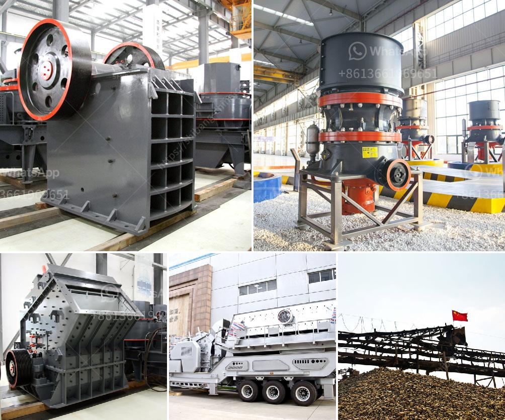

<h3>small stone crushing business in south africa</h3>
Small stone crushing business in South Africa is a booming industry, with the majority of individuals looking to start their own business. Even though entrepreneurship in this sector has previously been seen as risky, lucrative potentials are highly plausible. With the advent of technology, small stone crushing businesses have flourished in various parts of the country. Such businesses require minimal infrastructure and a small investment, making them a viable option for aspiring entrepreneurs.

One of the primary advantages of starting a small stone crushing business is that it has high-profit margins. Individuals in the construction industry are constantly in need of crushed stone for various purposes, such as building foundations, road bases, and landscaping. This unending demand creates a stable customer base for small stone crushing businesses.

Another key advantage is the low operational costs associated with this business. Small stone crushing businesses require minimal resources, including manpower, machinery, and raw materials. Additionally, the simplicity of the process ensures that entrepreneurs can quickly train their employees, reducing the overall labor costs.

Furthermore, the South African government has introduced initiatives to support small businesses. Various loan schemes and grants are available to aspiring entrepreneurs in this sector, making it easier to secure funding for the initial investment. Additionally, the government has implemented streamlined processes for obtaining business licenses and permits, further promoting a favorable business environment.

However, it is important to note that like any business, starting a small stone crushing business in South Africa has its own set of challenges. Competitive pricing, market saturation, and equipment maintenance are just a few aspects that entrepreneurs need to consider. It is crucial to conduct thorough market research and create a solid business plan to mitigate these risks.

In conclusion, starting a small stone crushing business in South Africa can be a viable business opportunity. Entrepreneurs in this sector have numerous advantages, such as high-profit margins and low operational costs. However, careful market analysis and business planning are crucial to ensure long-term success in this competitive industry.
<h3>Contact us</h3><ul><li><strong>Whatsapp:&nbsp;<a href="https://wa.me/8613661969651">+8613661969651</a></strong></li><li><a href="https://swt.shibang-china.com/?git&amp;zhl&amp;small stone crushing business in south africa"><strong>Online Service(chat now)</strong></a></li></ul><h3>Related</h3><ul><li><a href='raymond mill manufacturer in india.md'>raymond mill manufacturer in india</a></li><li><a href='stone crushing plant project report doc.md'>stone crushing plant project report doc</a></li><li><a href='small grinding mill machine in india.md'>small grinding mill machine in india</a></li><li><a href='german hammer mill ceramic.md'>german hammer mill ceramic</a></li><li><a href='qurry crusher plant capacity.md'>qurry crusher plant capacity</a></li></ul>