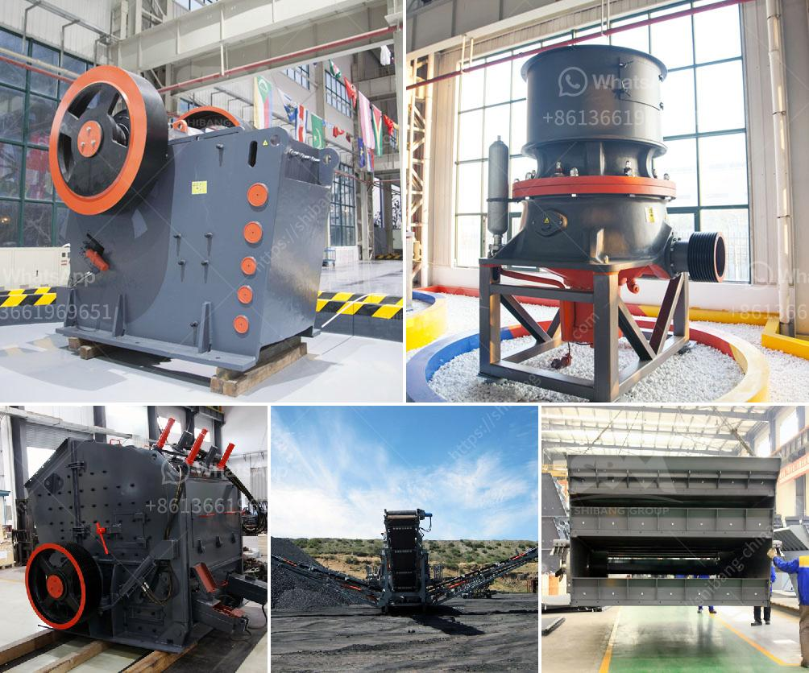

<h3>south africa jaw crushers</h3>
The South Africa jaw crushers marketplace is primarily driven by the country's strong mining industry, which has been one of the main sectors to witness a significant expansion in domestic jaw crushers industry. Demand for jaw crushers in South Africa is constantly growing, with a steady increase in disposable income and rising middle-class population, both of which are boosting the growth of the construction industry. Furthermore, the government's focus on infrastructure development is driving the demand for jaw crushers in the country.

Jaw crushers play a pivotal role in manufacturing and construction industries. They are used to crush rocks and various types of minerals, such as granite, limestone, basalt, copper, iron ore, and other hard materials. In mining applications, jaw crushers are used to crush large rocks into smaller pieces in order to reduce the size of the materials for further processing or to liberate valuable minerals from ores.

One of the key advantages of using jaw crushers is their ability to process rocks of a wide range of sizes. With their powerful crushing capabilities, they can easily break down materials of varying hardness, ensuring efficient and high-quality crushing. Jaw crushers are also equipped with safety devices, allowing the material to be safely crushed without causing harm to the crusher itself or the operator.

With their low maintenance requirements and easy operation, jaw crushers are ideal for the mining industry, as well as construction, demolition, and recycling applications. They can also be used for various other industries, such as metallurgy, ceramics, and glass making. The versatility of jaw crushers makes them highly sought after in the construction and mining industries.

In South Africa, the construction industry has been particularly affected by the ongoing COVID-19 pandemic. However, with the gradual easing of restrictions and the resumption of construction activities, there has been a steady recovery in the industry. This has led to an increased demand for jaw crushers in the country, driving the growth of the market.

To cater to this growing demand, jaw crushers manufacturers in South Africa have expanded their product range, introducing newer models with advanced features and specifications. These manufacturers are also focusing on developing new models that offer enhanced fuel efficiency and durability, thus gaining a competitive edge in the market. In addition, they are also investing in research and development activities to introduce innovative technologies and improve their product offerings.

In conclusion, South Africa jaw crushers market has seen a significant growth due to the expansion of the mining and construction industries. The South African jaw crushers market is projected to expand at a moderate CAGR during the forecast period, and manufacturers are focusing on expanding their distribution network and developing new jaw crushers to cater to the growing demand in the country.
<h3>Contact us</h3><ul><li><strong>Whatsapp:&nbsp;<a href="https://wa.me/8613661969651">+8613661969651</a></strong></li><li><a href="https://swt.shibang-china.com/?git&amp;zhl&amp;south africa jaw crushers"><strong>Online Service(chat now)</strong></a></li></ul><h3>Related</h3><ul><li><a href='working principle of ball mill pdf.md'>working principle of ball mill pdf</a></li><li><a href='portable diamond washing plant.md'>portable diamond washing plant</a></li><li><a href='coal crusher 10mm.md'>coal crusher 10mm</a></li><li><a href='gold mining equipments manufacturers in denmark.md'>gold mining equipments manufacturers in denmark</a></li><li><a href='impact crusher design.md'>impact crusher design</a></li></ul>