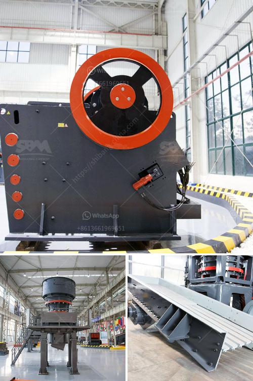

<h3>stamler coal crusher</h3>
The coal crusher is one of the most important coal processing equipment in the industrial environment. But did you know that the stamler coal crusher was one of the first types of coal crushers? They were widely used in the coal mining industry in the late 20th century and were more specifically known as feeder breakers.

Stamler coal crushers were one of the standout innovations in the industry. Initially, the stamler feeder breakers were predominantly used in coal mining applications. However, they soon expanded their market and became indispensable for other industries such as clay, limestone, phosphates, gypsum, and other similar materials handling operations.

So, what exactly is a stamler coal crusher? It is a rotary-style crushing machine. Traditional feeder breakers were designed to solve any material processing problem that traditional jaw crushers could not resolve. Due to their robust design, these machines are capable of accepting oversized feed materials, such as ROM coal.

The stamler coal crusher was not an independent stone crushing machine, like the hammer or jaw crushers, but rather a feeder breaker that offered a unique and cost-effective solution to the coal industry. This machine efficiently breaks down the coal, while also removing any rock contamination and fines, ensuring a low-cost production of consistent sized coal.

The feeder breaker is typically used in opencast coal mining to link the mobile and stationary equipment in the operational process. Unique to the stamler feeder breaker is the three-piece breaking mechanism, which allows for greater efficiency and a faster processing rate. This machine is ideal for coal blending operations and for various applications, such as coal washing, and the transport of coal from mines to power stations.

The reliability, robustness, and durability of stamler equipment has made it a preferred choice among coal operators since its introduction in the late 20th century. Today, various brands of feeder breakers are available, but the stamler coal crusher remains a popular choice for coal operators due to its ability to efficiently blend coal and remove contaminants. Moreover, its compact design and low-profile height ensure it can easily be integrated into existing conveyor systems.

In conclusion, the stamler coal crusher was designed with a unique three-piece breaking mechanism to efficiently break down oversized materials from underground coal mines, removing any and all impurities for reliable and efficient coal processing. With the continued use of stamler equipment by coal operators, the stamler feeder breaker offers a cost-effective solution to any crushing operation in various industries, ensuring continuous and consistent coal production.
<h3>Contact us</h3><ul><li><strong>Whatsapp:&nbsp;<a href="https://wa.me/8613661969651">+8613661969651</a></strong></li><li><a href="https://swt.shibang-china.com/?git&amp;zhl&amp;stamler coal crusher"><strong>Online Service(chat now)</strong></a></li></ul><h3>Related</h3><ul><li><a href='conveyor belts in france.md'>conveyor belts in france</a></li><li><a href='china clay processing plant cost in india.md'>china clay processing plant cost in india</a></li><li><a href='china cone crushers.md'>china cone crushers</a></li><li><a href='kenya crushing machinery performance.md'>kenya crushing machinery performance</a></li><li><a href='china raymond roller mills.md'>china raymond roller mills</a></li></ul>