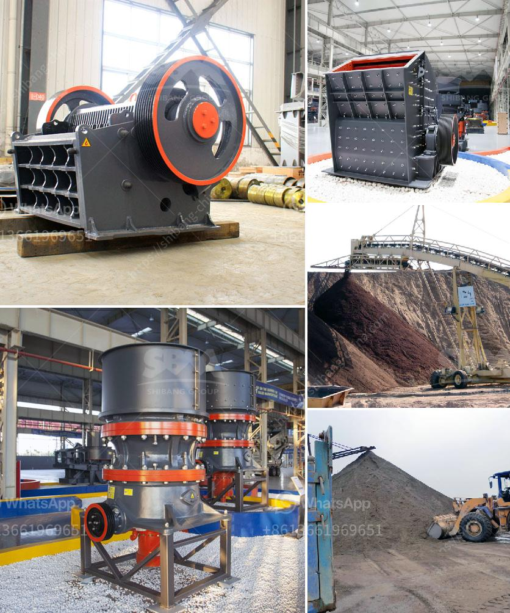

<h3>standards sizes of conveyor belts</h3>
Conveyor belts play a crucial role in modern industrial processes, efficiently transporting various types of materials across different locations. One key factor that ensures their successful functioning is the standardization of sizes. Standard sizes of conveyor belts are meticulously designed and maintained to ensure compatibility, convenience, and cost-effectiveness in material handling operations. This article aims to explore the importance of standard sizes in conveyor belts, highlighting their benefits and applications.

Standardization of conveyor belt sizes brings numerous advantages to industries worldwide. Firstly, it ensures compatibility between different components of the conveyor system. Roller diameters, pulley dimensions, and motor specifications are all designed adhering to these standard sizes, allowing for easy integration and replacement of parts. This compatibility promotes efficient communication and cooperation among suppliers, manufacturers, and maintenance teams, reducing downtime and increasing productivity.

Moreover, standard sizes enhance convenience during installation and maintenance. With standardized belts, operators can easily find matching components and accessories, such as fasteners, guides, and cleaners, ensuring seamless integration and swift repairs. Additionally, maintenance becomes more straightforward as technicians can quickly identify and replace worn-out or damaged sections. This reduces time and effort required for maintenance, subsequently increasing the operational uptime of the conveyor system.

Standardization also offers cost-effectiveness in material handling operations. Uniform belt sizes significantly reduce the need for specialized equipment, which can be expensive and challenging to procure. It enables manufacturers to produce conveyor belts in bulk, leading to economies of scale and reduced product costs. Similarly, standard sizes simplify inventory management by allowing organizations to stock common sizes, rather than maintaining a wide range of variations. This streamlined inventory approach minimizes storage costs and simplifies logistics.

Standard belt sizes have versatile applications across various industries. In manufacturing plants, conveyor belts transport raw materials, products, and components, optimizing production processes. They are extensively used in mining operations to extract and transport minerals, coal, and aggregates. The food industry relies on conveyor belts to handle and process ingredients, conduct quality checks, and package finished products. Furthermore, distribution centers heavily rely on conveyor systems to sort, transfer, and dispatch goods efficiently. They also find applications in airports, warehouses, and retail stores, streamlining logistics and facilitating effective inventory management.

Standardization is an ongoing process in the conveyor belt industry to keep up with technological advancements and changing market needs. As materials and technologies evolve, so do the requirements for conveyor systems. Manufacturers regularly update and expand their range of standard sizes to accommodate these changes. This continuous improvement fosters innovation, ensuring that conveyor belts remain adaptable to diverse material handling demands.

In conclusion, standard sizes of conveyor belts play a vital role in ensuring efficiency and versatility in material handling operations. Compatibility, convenience, and cost-effectiveness are some of the key advantages offered by standardized sizes. Additionally, various industries benefit from these standardized belts, utilizing them in different applications. Continuous standardization efforts in the conveyor belt industry showcase the commitment to meeting ever-evolving demands and driving forward the efficiency of material handling processes.
<h3>Contact us</h3><ul><li><strong>Whatsapp:&nbsp;<a href="https://wa.me/8613661969651">+8613661969651</a></strong></li><li><a href="https://swt.shibang-china.com/?git&amp;zhl&amp;standards sizes of conveyor belts"><strong>Online Service(chat now)</strong></a></li></ul><h3>Related</h3><ul><li><a href='screen mobile crusher.md'>screen mobile crusher</a></li><li><a href='used ball mill in gujrat.md'>used ball mill in gujrat</a></li><li><a href='grinding mills jalandhar.md'>grinding mills jalandhar</a></li><li><a href='crusher run for sale in sabah.md'>crusher run for sale in sabah</a></li><li><a href='barite mining equipment.md'>barite mining equipment</a></li></ul>