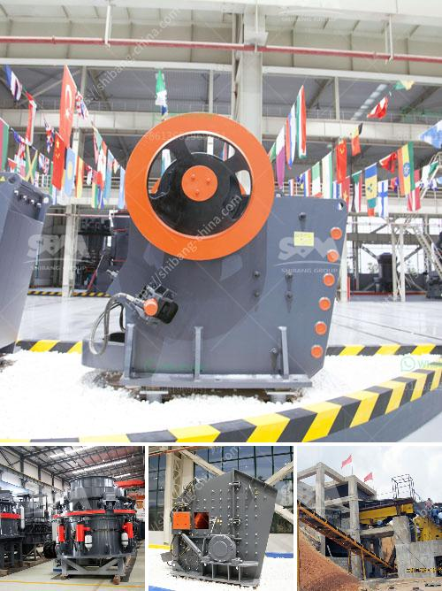

<h3>static jaw crusher and plant for sale</h3>
When it comes to the mining industry, jaw crushers are widely used for crushing large rocks and stones into smaller sizes to be used for construction or other purposes. One type of jaw crusher that is commonly used is the static jaw crusher. Unlike other types of crushers, the static jaw crusher is fixed, meaning it doesn't move or rotate during operations. This makes it a reliable choice for crushing tasks.

A static jaw crusher consists of a stationary jaw plate and a movable jaw plate. The stationary jaw plate is fixed to the crusher frame, while the movable jaw plate moves back and forth towards the fixed jaw plate, creating a compression force to crush the rocks. This compression force is achieved by the two jaw plates coming together, crushing the material between them.

Static jaw crushers are known for their high performance and durability. They are designed to handle tough materials, such as granite, basalt, and other hard rocks. This makes them suitable for use in demanding mining and quarrying applications. Additionally, static jaw crushers are easy to operate and maintain, thanks to their simple design.

If you're in need of a static jaw crusher and plant, there are various options available in the market. Many reputable manufacturers offer a range of static jaw crushers with different specifications to meet your specific requirements. These crushers can be equipped with various features, such as hydraulic adjustment, allowing you to control the size of the crushed material.

When looking for a static jaw crusher and plant for sale, it is important to consider factors such as the desired capacity, output size, and the material you plan to crush. Additionally, you should also consider the overall durability and reliability of the equipment, as well as the after-sales service provided by the manufacturer.

In conclusion, static jaw crushers are a reliable and efficient solution for crushing large rocks and stones. Whether you need them for mining, quarrying, or construction purposes, static jaw crushers offer high performance and durability. With various options available in the market, you can easily find a static jaw crusher and plant for sale that meets your specific requirements.
<h3>Contact us</h3><ul><li><strong>Whatsapp:&nbsp;<a href="https://wa.me/8613661969651">+8613661969651</a></strong></li><li><a href="https://swt.shibang-china.com/?git&amp;zhl&amp;static jaw crusher and plant for sale"><strong>Online Service(chat now)</strong></a></li></ul><h3>Related</h3><ul><li><a href='conveyor belt consultants.md'>conveyor belt consultants</a></li><li><a href='accounting entry on crushing plant.md'>accounting entry on crushing plant</a></li><li><a href='lime stone crusher.md'>lime stone crusher</a></li><li><a href='calcium calcium carbonate plants calcium.md'>calcium calcium carbonate plants calcium</a></li><li><a href='used machines from china.md'>used machines from china</a></li></ul>