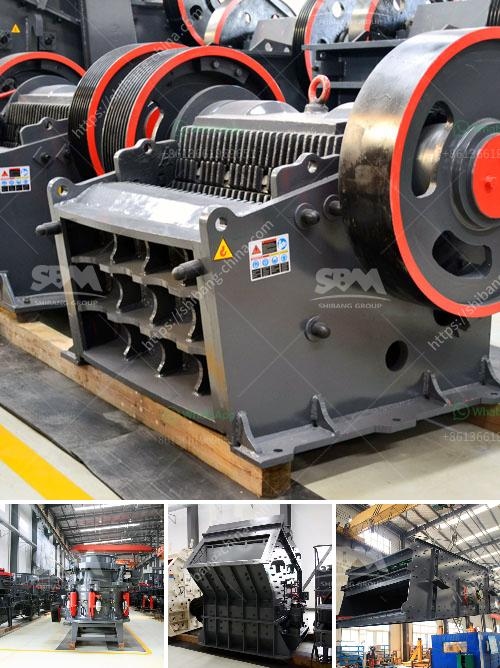

<h3>stationary screening for screening process</h3>
Title: Enhancing Efficiency and Accuracy: The Benefits of Stationary Screening in the Screening Process

The screening process is an essential component of various sectors and industries, ensuring security, safety, and effective decision-making. When it comes to screening individuals or objects, implementing efficient and accurate methods is vital. One such technique gaining popularity is stationary screening. In this article, we will explore what stationary screening entails, its advantages, and its role in enhancing the screening process.

Stationary screening refers to a screening method where individuals or objects pass through a fixed detection system instead of portable devices or manual screening techniques. It involves using fixed equipment such as metal detectors, X-ray machines, or advanced technology systems like millimeter-wave scanners or biometric sensors.

Implementing stationary screening systems significantly improves efficiency in the screening process. With stationary equipment firmly in place, throughput and processing times are accelerated, reducing queues and waiting periods. This is particularly valuable when screening large numbers of individuals, such as in airports, train stations, or event venues, where time is of the essence.

Stationary systems offer superior accuracy compared to manual or portable alternatives. Advanced technologies used in stationary screening equipment, such as image recognition algorithms or biometric sensors, can detect even the most minute anomalies, ensuring a higher level of security and eliminating the risk of human error. This accuracy is crucial in preventing contraband, weapons, or dangerous substances from entering restricted areas.

The presence of stationary screening systems acts as a strong deterrent against potential threats. The visibility of these fixed screening devices serves as a psychological barrier to illicit activities, discouraging individuals from attempting to bypass security measures. Consequently, the mere deployment of stationary screening equipment can greatly minimize security risks in various environments.

Stationary screening systems often enable remote monitoring and integration with central security control rooms. This allows security personnel to monitor and analyze the screening process in real-time, enhancing situational awareness and response capabilities. The integration of stationary screening equipment with existing security infrastructure, such as surveillance cameras or access controls, creates a comprehensive security ecosystem.

By employing stationary screening systems, organizations can ensure consistent and standardized screening procedures. This eliminates subjective interpretation, reduces human error, and ensures uniformity across multiple screening checkpoints. Standardized processes contribute to heightened security levels by minimizing potential loopholes in the screening process.

Stationary screening offers a multitude of advantages that greatly enhance the efficiency and accuracy of the screening process. Whether deployed at airports, train stations, government buildings, or event venues, stationary screening equipment serves as a strong deterrent against potential threats while providing accurate detection capabilities that consistently minimize security risks. Through the implementation of stationary screening, organizations can create a safer and more secure environment for employees, visitors, and the public, underlining the importance of staying at the forefront of screening technologies.
<h3>Contact us</h3><ul><li><strong>Whatsapp:&nbsp;<a href="https://wa.me/8613661969651">+8613661969651</a></strong></li><li><a href="https://swt.shibang-china.com/?git&amp;zhl&amp;stationary screening for screening process"><strong>Online Service(chat now)</strong></a></li></ul><h3>Related</h3><ul><li><a href='chinese mobile crusher.md'>chinese mobile crusher</a></li><li><a href='granite stone crusher india.md'>granite stone crusher india</a></li><li><a href='rock crusher for sale in sudan.md'>rock crusher for sale in sudan</a></li><li><a href='granite crushers for sale.md'>granite crushers for sale</a></li><li><a href='cost of stone crushing plant.md'>cost of stone crushing plant</a></li></ul>