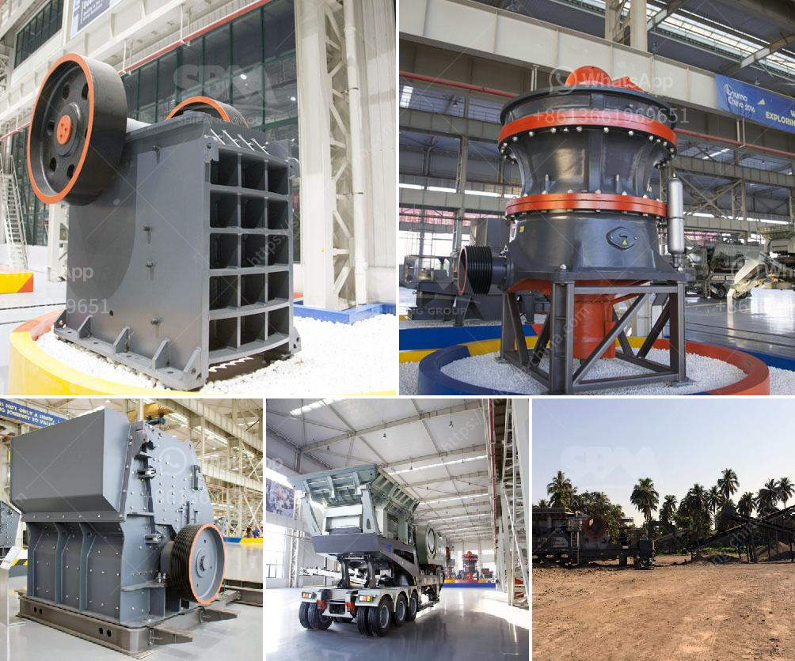

<h3>stone conveyor belt design manual pdf</h3>
Stone conveyor belts are an essential component in the mining and construction industries. These belts help transport heavy materials, such as rocks, gravel, and sand, from one location to another. To ensure smooth operations and maximum efficiency, it is crucial to design these conveyor belts effectively.

The stone conveyor belt design manual serves as a comprehensive guide for engineers and experts involved in the conveyor system's design and implementation. This document outlines essential considerations that need to be taken into account while designing stone conveyor belts. It focuses on factors like belt material selection, belt width, troughing angle, load support, and belt tension.

One of the critical aspects covered in the design manual is belt material selection. Stone conveyor belts must be made from durable and robust materials that can withstand heavy loads, abrasive materials, and extreme weather conditions. The manual provides a detailed overview of various belt materials like rubber, PVC, nylon, and steel, along with their pros and cons.

Proper belt width selection is crucial to ensure efficient material handling. The manual offers guidelines to calculate the optimal belt width based on the material's maximum lump size, the speed of the conveyor, and the required capacity.

Troughing angle plays a significant role in ensuring proper material flow and preventing spillage. The design manual provides formulas to determine the ideal troughing angle based on factors such as material characteristics, conveyor length, and inclination angle.

Load support and belt tension are two critical factors to prevent belt sagging and maintain the conveyor's smooth operation. The manual provides guidance on determining the required load support and calculating the belt tension based on the conveyor's length, capacity, and belt material.

In conclusion, the stone conveyor belt design manual is an invaluable resource for engineers and professionals involved in designing stone conveyor belts. By following the guidelines and specifications outlined in this manual, they can create efficient, durable, and reliable conveyor systems for the mining and construction industries.
<h3>Contact us</h3><ul><li><strong>Whatsapp:&nbsp;<a href="https://wa.me/8613661969651">+8613661969651</a></strong></li><li><a href="https://swt.shibang-china.com/?git&amp;zhl&amp;stone conveyor belt design manual pdf"><strong>Online Service(chat now)</strong></a></li></ul><h3>Related</h3><ul><li><a href='wet process feldspar supplier.md'>wet process feldspar supplier</a></li><li><a href='limestone quarry operations.md'>limestone quarry operations</a></li><li><a href='gypsum recycling machines for sale.md'>gypsum recycling machines for sale</a></li><li><a href='silica iron ore silver seperation machine.md'>silica iron ore silver seperation machine</a></li><li><a href='costs of calcium carbonate making machinery in japan.md'>costs of calcium carbonate making machinery in japan</a></li></ul>