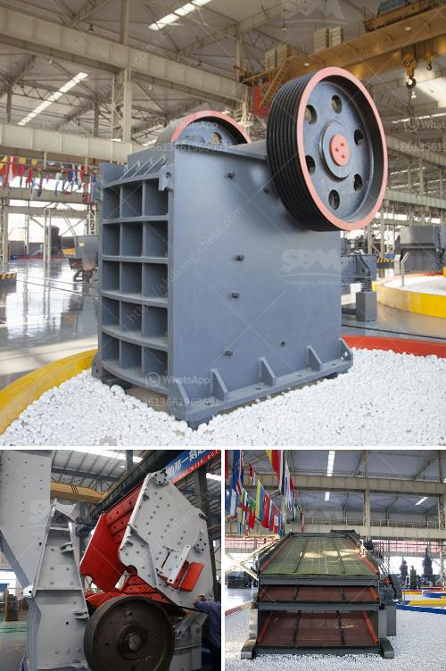

<h3>stone crusher accounting in tally</h3>
Stone crusher accounting in Tally ERP software is one of the most widely used software solutions for stone crushing companies across the globe. It has helped businesses of all sizes and sectors to improve their productivity and streamline their operations. With its robust features and functionalities, it has become a preferred choice for the stone crusher industry.

Tally ERP software provides various modules and features that are essential for the smooth functioning of stone crusher units. Some of these modules include financial accounting, inventory management, sales, purchase, and manufacturing. These modules are characterized by their user-friendly interface and comprehensive functionalities that cater to the specific needs of stone crusher businesses.

One of the key advantages of using Tally for stone crusher accounting is its ability to generate accurate financial reports, such as Profit and Loss statements and Balance Sheets. These reports help businesses assess their financial health, identify areas of improvement, and make informed decisions. With Tally's advanced reporting system, stone crusher businesses can easily monitor their revenue, expenditure, and profitability.

Tally ERP software also provides robust inventory management features that are crucial for stone crusher companies. With its inventory module, businesses can efficiently manage their stock levels, track items, and avoid stock-outs or overstocking. This helps in reducing operational costs and improving customer satisfaction by ensuring timely delivery of products.

Furthermore, Tally ERP software allows stone crusher businesses to streamline their sales and purchase processes. It enables businesses to generate quotations, sales orders, purchase orders, and invoices effortlessly. These documents can be customized as per the business requirements, ensuring accuracy and professionalism in all transactions.

In addition to inventory and sales management, Tally also provides manufacturing capabilities. Stone crusher businesses can utilize this module to efficiently manage their production processes, track material utilization, and control wastages. With Tally, businesses can easily monitor their production costs, analyze production trends, and identify areas for improvement.

Tally ERP software also offers seamless integration with other applications and tools, making it an ideal solution for stone crusher businesses. It can integrate with banking applications, e-commerce platforms, HR management systems, and other third-party applications, ensuring smooth data flow across different departments and functions.

Moreover, Tally ERP software ensures data security and confidentiality. It provides role-based access control, allowing businesses to restrict access to sensitive information. This ensures that only authorized personnel can view or modify critical data, protecting it from unauthorized access or manipulation.

In conclusion, Tally ERP software is an ideal accounting solution for stone crusher businesses due to its comprehensive features and functionalities. It helps businesses streamline their operations, improve productivity, and make informed decisions. With its robust inventory, sales, purchase, and manufacturing modules, Tally ensures accuracy, efficiency, and transparency in stone crusher accounting processes.
<h3>Contact us</h3><ul><li><strong>Whatsapp:&nbsp;<a href="https://wa.me/8613661969651">+8613661969651</a></strong></li><li><a href="https://swt.shibang-china.com/?git&amp;zhl&amp;stone crusher accounting in tally"><strong>Online Service(chat now)</strong></a></li></ul><h3>Related</h3><ul><li><a href='limestone crusher philippines.md'>limestone crusher philippines</a></li><li><a href='grinding machine for industrial use.md'>grinding machine for industrial use</a></li><li><a href='distributor philippines test sieve retsch.md'>distributor philippines test sieve retsch</a></li><li><a href='techniques chips of metal conveyor belts.md'>techniques chips of metal conveyor belts</a></li><li><a href='granite crusher factory.md'>granite crusher factory</a></li></ul>