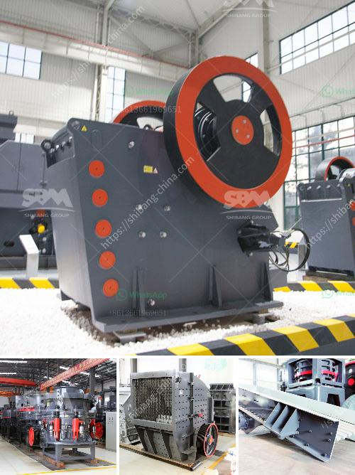

<h3>stone crusher and quarry plant in jordan</h3>
Stone crusher plant is designed to process various rocks and ores, such as limestone, granite, basalt, iron ore, gold ore and copper ore. Quarry plant is used for manufacturing building aggregates and sands. The plant mines and crushes various types of rock, including limestone, basalt, granite, and iron ore into gravel, sand, and other construction materials.

The crushers are widely used in mining, metallurgy, construction, chemical, water conservancy, transportation, etc. It has the features of large crushing ratio, uniform product size, simple structure, reliable performance, easy maintenance, and low operating cost. The stone crusher plant also includes vibrating feeder, jaw crusher, impact crusher, vibrating screen, belt conveyor, and centrally electric controlling system, etc.

Quarry plants are used in various sectors such as construction, building materials, mining, metallurgy, and highways. The quarry plants are used for extraction of aggregates and sands. These materials are widely used in construction projects and infrastructure development. The quarry plants are environmentally friendly, as they utilize natural resources efficiently and minimize waste generation.

Jordan has a rich mineral resources, such as limestone, granite, basalt, iron ore, gold ore, and copper ore. Therefore, the stone crusher and quarry plant in Jordan is popular among customers. SBM offers a wide range of stone quarry plants, including limestone quarry plant, granite quarry plant, basalt quarry plant, iron ore quarry plant, and gold ore quarry plant.

The stone crusher and quarry plant in Jordan not only provide customers with high quality products, but also offers first-class service. Whether you are interested in the mining industry or construction fields, SBM will provide you with professional assistance. SBM is dedicated to providing complete solutions and supporting equipment for mining and quarrying applications.

In summary, stone crusher and quarry plant in Jordan are used for manufacturing building aggregates and sands. SBM is a famous stone crusher manufacturer in China, and offer types of stone crushers for sale for quarrying and mining industry in Europe, USA, Africa, and Asia.
<h3>Contact us</h3><ul><li><strong>Whatsapp:&nbsp;<a href="https://wa.me/8613661969651">+8613661969651</a></strong></li><li><a href="https://swt.shibang-china.com/?git&amp;zhl&amp;stone crusher and quarry plant in jordan"><strong>Online Service(chat now)</strong></a></li></ul><h3>Related</h3><ul><li><a href='quartz stone crusher plants made in turkey.md'>quartz stone crusher plants made in turkey</a></li><li><a href='sliding shoe bearing ball mill skf.md'>sliding shoe bearing ball mill skf</a></li><li><a href='grinding mill machine.md'>grinding mill machine</a></li><li><a href='dolomite processing plant.md'>dolomite processing plant</a></li><li><a href='grind limestone to 60 mesh.md'>grind limestone to 60 mesh</a></li></ul>