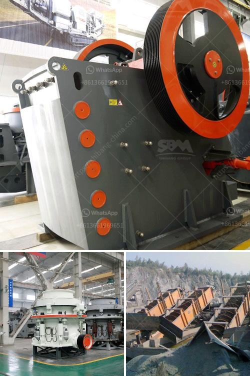

<h3>stone crusher equipments</h3>
Stone Crusher Equipments: A crusher is a machine designed to reduce large rocks into smaller rocks, gravel, sand, or rock dust. Nowadays, stone crushers are used in a wide variety of industries such as mining, construction, metallurgy, petrochemicals, transportation, energy, building materials, and the chemical industry. These machines have their own specific uses and are crafted to meet different requirements.

One of the key components in stone crushing equipment is the hammer crusher. The size and shape of the hammers can have a significant impact on the selection process. There are many factors to consider when choosing the right hammer for the job, such as the material being crushed, the hardness of the material, the feed size, and the required product size. The hammer crusher is widely used in cement plants, mining plants, and power plants, making it one of the most versatile pieces of equipment in the industry.
<h3>Contact us</h3><ul><li><strong>Whatsapp:&nbsp;<a href="https://wa.me/8613661969651">+8613661969651</a></strong></li><li><a href="https://swt.shibang-china.com/?git&amp;zhl&amp;stone crusher equipments"><strong>Online Service(chat now)</strong></a></li></ul><h3>Related</h3><ul><li><a href='clinker grinding plant.md'>clinker grinding plant</a></li><li><a href='typical 100tph jaw crusher feed size.md'>typical 100tph jaw crusher feed size</a></li><li><a href='granite quarry machinery for sale.md'>granite quarry machinery for sale</a></li><li><a href='latest chrome crush and wash plant for sale in rsa.md'>latest chrome crush and wash plant for sale in rsa</a></li><li><a href='pebbel stone crusher.md'>pebbel stone crusher</a></li></ul>