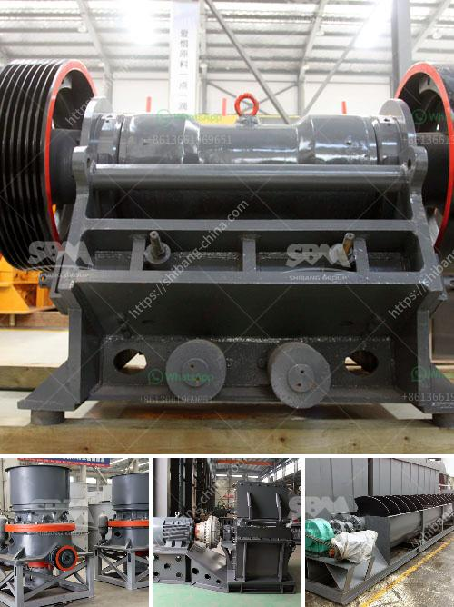

<h3>stone crusher for sale in sri lanka</h3>
Stone crusher is a machine designed to reduce large rocks into smaller rocks, gravel, or rock dust. It is widely used in mining, construction, material handling, and other industries. Sri Lanka is renowned for its rich reserves of various types of quarry and mining resources, with several large-scale mines and quarries located throughout the country. Stone crusher machines are utilised to crush stones into small particles or alter the form such as limestone, quartz, marble, granite and recycle developing waste resources such as debris, asphaltic cement concrete.

Stone crusher machines are typically designed with a primary crushing system, followed by secondary crushing, and screening stages. The primary crushing system usually consists of a jaw crusher or gyratory crusher, depending on the capacity requirement of the plant.

Jaw crusher is the most widely used primary stone crusher in modern mining and construction industry. It has been extensively used in many applications, such as quarrying, mining, smelting, building materials, highway, railway, water conservancy, chemical industry, etc. Jaw crusher can be used for primary, secondary, and fine crushing of stones and cone crusher is usually used for crushing of stones with medium and high hardness.

Sri Lanka is a tropical island nation located in the Indian Ocean, with a diverse natural environment consisting of lush forests, beaches, wildlife, and biodiversity. Therefore, it is an ideal location for eco-tourism and various types of outdoor activities. The country has a growing tourism industry, which has led to an increased demand for quality construction materials.

Stone crushers play a critical role in the production of aggregates used in the construction industry. The demand for aggregates has increased significantly over the last few years due to the growth of the construction sector in Sri Lanka. This has resulted in a high demand for stone crushers that are capable of producing aggregates of various sizes.

There are numerous stone crushers for sale in Sri Lanka. Some have a high capacity and are capable of crushing up to 500 tons of stones per hour. The price of stone crushers in Sri Lanka depends on their output capacity and other features. These machines can be expensive, but choosing a machine with the right specifications and features can save you money in the long run.

Stone crushers have been used for centuries in the mining and construction industries. In the past, they were powered by animals or by hand, but now they are powered by electricity or diesel engines. Since stone crushers can be used on construction sites and in stone quarries, they are also suitable for various other applications, such as road construction, railway track laying, building demolition, and recycling of construction waste.

In conclusion, stone crusher machines have played an important role in the construction industry in Sri Lanka. In recent years, they have been highly appreciated for their excellent performance and reliable crushing capacity. If you are in need of a stone crusher machine in Sri Lanka, get in touch with us, and we will be happy to assist you with your purchasing needs.
<h3>Contact us</h3><ul><li><strong>Whatsapp:&nbsp;<a href="https://wa.me/8613661969651">+8613661969651</a></strong></li><li><a href="https://swt.shibang-china.com/?git&amp;zhl&amp;stone crusher for sale in sri lanka"><strong>Online Service(chat now)</strong></a></li></ul><h3>Related</h3><ul><li><a href='stone crushing machines for sale in philippines.md'>stone crushing machines for sale in philippines</a></li><li><a href='cost of vertical roller mill.md'>cost of vertical roller mill</a></li><li><a href='composetion of terracotta tiles.md'>composetion of terracotta tiles</a></li><li><a href='vertical mill size.md'>vertical mill size</a></li><li><a href='ball mill manufacturers in pune.md'>ball mill manufacturers in pune</a></li></ul>