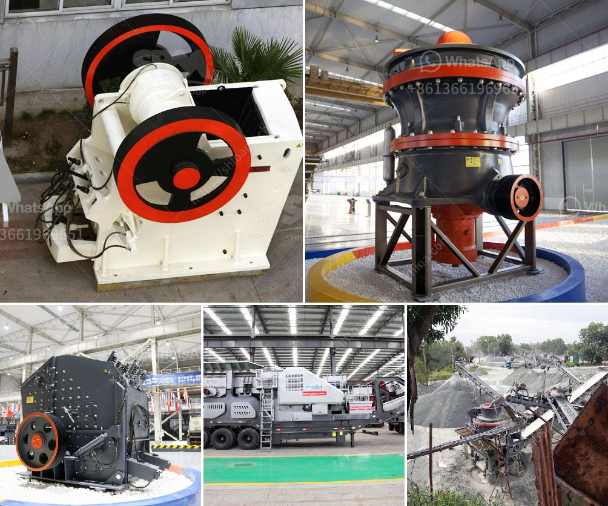

<h3>stone crusher for sale kenya</h3>
Stone crusher for sale in Kenya is increasingly becoming more popular in mining, construction, and other industries. The vast majority of people have adopted the use of stone crushers in their daily activities, which has led to the introduction of various crusher types in the market.

Stone crushing machines are used in different sectors, such as mining, construction, building materials, highways, railways, and so on. In Kenya, the stone crushing industry has been growing rapidly due to increasing demand from the construction sector and other industrial activities.

Stone crushers are primarily small scale industries in the unorganized sector. They are found mostly in the rural areas, near the urban and industrial areas where construction activities are prominent. The technology and equipment used in stone crushing plants have advanced over the years, making crushers more efficient and safer to use.

The market for stone crushers in Kenya is very competitive, with multiple players such as International, Metso, Sandvik, and Terex. Some of the key players in the market include Nakayama Iron Works Ltd., Atlas Copco AB, Komatsu Ltd., and Hitachi Construction Machinery Co., Ltd.

Stone crushers have different capacities to meet the needs of customers, and sales and rental options are also available. Some stone crushers for sale in Kenya can have a capacity of up to 1000 tons per hour. Personalize the machines according to customers' needs, which include production capacity, input size, output size, types of raw material, and the requirements of the final products.

Many crushing and screening plants in Kenya are equipped with advanced control systems to improve efficiency and reduce the emission levels of harmful gases. Some of the key features include remote monitoring, real-time diagnostics, and predictive maintenance to ensure smooth operation and minimize downtime.

To conclude, the stone crusher market in Kenya is booming due to infrastructure development efforts, rapid urbanization, and economic growth. Stone crushers are essential equipment in mining, construction, building materials, and other industries, providing reliable performance and high efficiency. As the demand for stone crushers continues to increase, businesses and independent contractors can find a wide selection of crushers for sale in Kenya to meet their specific needs.
<h3>Contact us</h3><ul><li><strong>Whatsapp:&nbsp;<a href="https://wa.me/8613661969651">+8613661969651</a></strong></li><li><a href="https://swt.shibang-china.com/?git&amp;zhl&amp;stone crusher for sale kenya"><strong>Online Service(chat now)</strong></a></li></ul><h3>Related</h3><ul><li><a href='mill to pulverize stone crusher.md'>mill to pulverize stone crusher</a></li><li><a href='calcium calcium carbonate plants calcium.md'>calcium calcium carbonate plants calcium</a></li><li><a href='granite quarry machine.md'>granite quarry machine</a></li><li><a href='micro grinding mill.md'>micro grinding mill</a></li><li><a href='vertical conveyor for gravel transporting.md'>vertical conveyor for gravel transporting</a></li></ul>