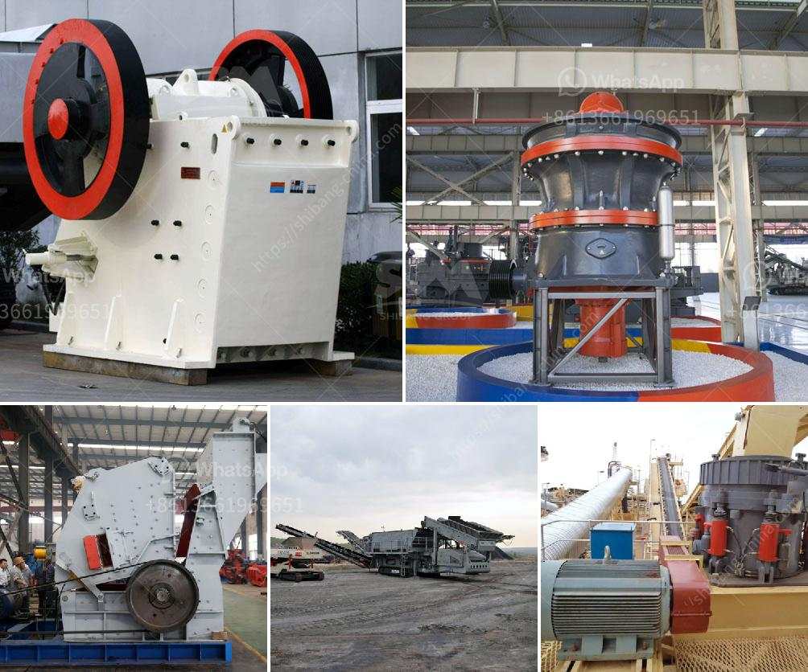

<h3>stone crusher in uganda</h3>
Stone crushing industry is a crucial industrial sector in Uganda. The crushed stones are used as raw materials for construction and infrastructure development activities such as road construction, bridge construction, building, and housing units construction, and other similar projects. In recent years, the demand for crushed stones has been increasing rapidly due to the growth in the construction sector.

A stone crusher, also known as rock crusher, is one of the most commonly used mining machines. It is designed to reduce large rocks into smaller rocks or gravel. Extensive and efficient crushing of materials is vital in industries like construction, quarrying, and mining. An essential equipment, they effortlessly reduce and process materials such as limestone, granite, river stones, basalt, shale, iron ore, copper ore, gold ore, etc.

In Uganda, the stone crushing industry operates both formal and informal sectors. As usual, women and girls are the most negatively affected due to gender-based violence related to stone crushing. Using such machines, women and girls usually engage in crushing stones by hand, a task that requires significant physical effort and poses serious health risks due to dust emissions. Additionally, working conditions in the industry are hazardous, leading to injuries and accidents.

To alleviate the negative impact of the stone crushing industry in Uganda, the government and other organizations have taken various steps. For instance, the government has banned the usage of outdated stone crushing machines, which contributed to high levels of pollution and accidents. The banned machines were inefficient and highly polluting, causing serious environmental degradation and affecting the health of the workers.

Efforts have also been made to provide training and awareness programs to the workers in the industry on the proper use of stone crushing machines. This is aimed at improving their working conditions and reducing the risk of accidents and injuries. Workers are now encouraged to use protective gear such as masks, helmets, and gloves to minimize exposure to dust and other harmful particles.

Furthermore, the government has introduced regulations and guidelines to ensure that stone crushing operations adhere to environmental and safety standards. Checks are carried out regularly to ensure compliance with these guidelines. Additionally, those found to be violating the regulations face strict penalties and fines.

To address the gender-based violence affecting women and girls in the stone crushing industry, advocacy and awareness campaigns have been conducted. These campaigns aim to sensitize the community to the importance of gender equality and the need to create a safe and conducive working environment for everyone.

In conclusion, the stone crushing industry plays a vital role in Uganda's economy, providing employment and income generation for various sectors of society. However, it is essential to address the negative impacts associated with this industry, such as health hazards and gender-based violence. With collaborative efforts from the government, organizations, and the community, it is possible to create a sustainable and responsible stone crushing industry in Uganda.
<h3>Contact us</h3><ul><li><strong>Whatsapp:&nbsp;<a href="https://wa.me/8613661969651">+8613661969651</a></strong></li><li><a href="https://swt.shibang-china.com/?git&amp;zhl&amp;stone crusher in uganda"><strong>Online Service(chat now)</strong></a></li></ul><h3>Related</h3><ul><li><a href='china multifunction peeling and crushing.md'>china multifunction peeling and crushing</a></li><li><a href='components of mobile coal processing plant.md'>components of mobile coal processing plant</a></li><li><a href='conveyor belt manufacturers in africa.md'>conveyor belt manufacturers in africa</a></li><li><a href='typical 100tph jaw crusher feed size.md'>typical 100tph jaw crusher feed size</a></li><li><a href='calculate costs of crushing limestone.md'>calculate costs of crushing limestone</a></li></ul>