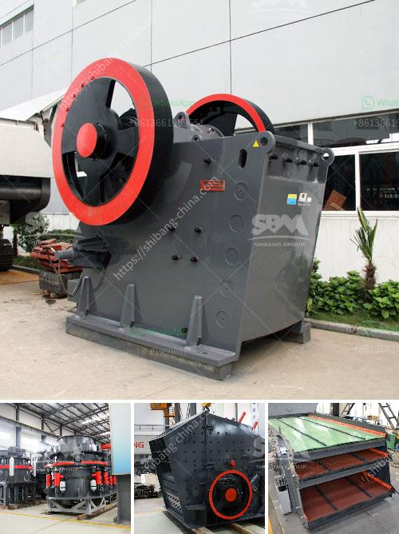

<h3>stone crusher kapasitas 150m</h3>
Stone crusher kapasitas 150m is one of the popular stone crushing machines used in mining and construction industry. With the increasing demand for stone products in various sectors, such as infrastructure, construction, and road building, stone crusher machines have gained significant popularity in recent years. 

Stone crusher kapasitas 150m refers to the capacity of the stone crusher machine to crush materials into specific sizes. With its strong power output and high crushing efficiency, this machine can handle various types of rocks and stones, including basalt, limestone, granite, and river pebble. 

The stone crusher kapasitas 150m is equipped with advanced technology, ensuring its reliability and durability. It has a robust construction that can withstand heavy-duty operations. Its powerful motor and high-speed rotating blades enable it to break down rocks and stones into smaller pieces, making it easier to transport and handle.

The stone crusher kapasitas 150m offers multiple benefits to its users. It can efficiently process large quantities of materials, saving time and labor. Moreover, its compact design makes it suitable for tight spaces where other larger machines may not fit. Additionally, its ease of use and maintenance ensure hassle-free operation and longer service life.

In conclusion, the stone crusher kapasitas 150m is a reliable and efficient machine that provides an excellent solution for crushing rocks and stones. Whether you are a construction company, road contractor, or mining company, this machine can help you produce high-quality stone products efficiently. It is a valuable asset that can increase productivity and profitability in your operations.
<h3>Contact us</h3><ul><li><strong>Whatsapp:&nbsp;<a href="https://wa.me/8613661969651">+8613661969651</a></strong></li><li><a href="https://swt.shibang-china.com/?git&amp;zhl&amp;stone crusher kapasitas 150m"><strong>Online Service(chat now)</strong></a></li></ul><h3>Related</h3><ul><li><a href='crusher machine for unit.md'>crusher machine for unit</a></li><li><a href='lafarge evander quartz crushers.md'>lafarge evander quartz crushers</a></li><li><a href='chromium ore mining equipmentr.md'>chromium ore mining equipmentr</a></li><li><a href='silica sand mines in philippines.md'>silica sand mines in philippines</a></li><li><a href='calcium carbonate grinding.md'>calcium carbonate grinding</a></li></ul>