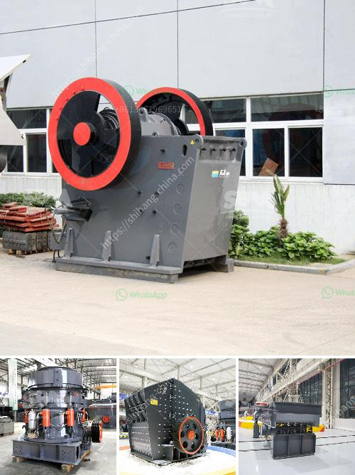

<h3>stone crusher machine factory in cambodia</h3>
Stone Crusher Machine Factory in Cambodia is along-term commitment to provide customers with quality and affordable products. It has become synonymous with high-quality products in the quarrying and mining industry. Dongmeng Machinery manufactures and install crushing, grinding, screening, washing and conveying systems for stationary and mobile applications.

Dongmeng Machinery is one of the leading stone crusher machine factory in Cambodia, catering to various types of rocks such as limestone, granite, basalt, iron ore, gold ore, bauxite, etc. It has the ability to crush and screen materials to meet customer requirements. The machine is equipped with a high-quality jaw crusher and a vertical shaft impact crusher. There are also other supporting equipment such as a circular vibrating screen, a feeder, and a conveyor.

The stone crusher machine factory in Cambodia provides a one-stop solution to customers' needs, providing customers with a complete range of crushing and screening equipment, spare parts and consumables, aftersales support, etc. It aims to provide customers with efficient, stable, and high-quality equipment, ensuring customers receive the best value for their investment.

Dongmeng Machinery understands that customer satisfaction is crucial for long-term success. Therefore, it has implemented a strict quality control system to ensure that each machine meets international standards. The company has obtained ISO9001: 2000 international quality system certification, CE certification, etc. This guarantees customers that they are purchasing reliable and durable equipment.

The stone crusher machine factory in Cambodia has a team of experienced technicians who can help customers choose the right crushing equipment. Also, the factory has bilingual technicians who can help customers communicate more effectively. This ensures that customers can understand the equipment's working principles, maintenance methods, and troubleshooting techniques, maximizing the equipment's performance and extending its service life.

In addition to providing high-quality equipment, the company also offers comprehensive aftersales support. The stone crusher machine factory in Cambodia provides free installation, free training, free equipment debugging, and technical support. Customers can rely on the factory's fast response and efficient service team for help in case of any issue or query.

Stone crusher machine factory in Cambodia, with its excellent durability and quality, has earned a good reputation among the customers and has become one of the favorite choices of many customers. The factory has a strong production capacity and produces up to 1000 machines per year. With its efficient and reliable performance, the stone crushing machines from the factory have a significant impact on the Cambodian mining industry.

In conclusion, the stone crusher machine factory in Cambodia is committed to providing customers with quality and affordable crushing equipment. It offers a complete range of crushing and screening equipment, spare parts, and aftersales support. It aims to provide customers with efficient, stable, and high-quality equipment, ensuring customers receive the best value for their investment. With its excellent durability and quality, the factory has earned a good reputation among customers and has become one of the favorite choices of many customers.
<h3>Contact us</h3><ul><li><strong>Whatsapp:&nbsp;<a href="https://wa.me/8613661969651">+8613661969651</a></strong></li><li><a href="https://swt.shibang-china.com/?git&amp;zhl&amp;stone crusher machine factory in cambodia"><strong>Online Service(chat now)</strong></a></li></ul><h3>Related</h3><ul><li><a href='cost of mining conveyor belt.md'>cost of mining conveyor belt</a></li><li><a href='best stone crushers india.md'>best stone crushers india</a></li><li><a href='course sand manufacturers in india.md'>course sand manufacturers in india</a></li><li><a href='barite crusher plant.md'>barite crusher plant</a></li><li><a href='cone crusher manufacturers china.md'>cone crusher manufacturers china</a></li></ul>