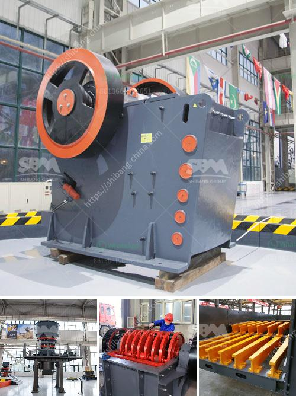

<h3>stone crusher machine for home use in south africa</h3>
Stone crusher machines are widely used in the mining industry, where they are used to crush hard and abrasive materials for the refining of metals. They are also used to process sand and gravel for construction purposes and in the recycling of waste material. Stone crusher machines can be used for crushing of numerous materials, such as limestone, granite, coal, zinc, tantalum ore, iron ore, dolomite, limestone, basalt, and various other rocks. These machines can also be used to crush harder and more abrasive materials, such as sandstone and granite.

In South Africa, stone crusher machines are increasingly popular for home use. With the rapid development of the South African economy, there has been a significant increase in the construction industry's demand for stone crushers. This has driven the development of stone crushing machines, such as jaw crushers, cone crushers, and impact crushers.

Jaw crushers are used to crush the extracted material between two jaws, which apply pressure to the material, breaking it into smaller pieces. Jaw crushers are commonly used in the mining and construction industries to crush materials ranging in hardness from softer limestone to harder granite.

Cone crushers, on the other hand, are used to crush medium-hard to hard and abrasive materials, such as basalt, granite, and ore. They work by squeezing the material between an eccentrically gyrating spindle and a concave hopper. Cone crushers are commonly used in the mining and aggregate industries and can produce high-quality products with a relatively low energy consumption.

Impact crushers are versatile machines that can be used for a variety of applications. They work by throwing the material against a surface, such as a wall or an anvil, causing it to break into smaller pieces. Impact crushers are commonly used in the recycling industry to process materials such as concrete, asphalt, and demolition waste.

Stone crusher machines for home use in South Africa are ideal for crushing various materials, such as granite, limestone, marble, basalt, cobblestone, river pebbles, copper ore, iron ore, and other stone materials. These materials can be used in various construction applications, such as roads, buildings, bridges, and railways.

Stone crusher machines for home use in South Africa can be used to produce high-quality sand and gravel aggregate from various materials, such as limestone, granite, and basalt. The sand and gravel aggregate produced by these machines can be used in construction projects and concrete production. They can also be used in the production of asphalt and other construction materials.

One of the advantages of stone crusher machines for home use in South Africa is their versatility. These machines can be used for a wide range of materials and applications, making them suitable for various industries. Additionally, the machines are easy to operate and maintain, reducing downtime and increasing productivity.

In conclusion, stone crusher machines for home use in South Africa are versatile and affordable machines for crushing various materials. They can be used to produce high-quality sand and gravel aggregate, which is widely used in construction projects and concrete production. These machines are an essential tool in the mining and construction industries, helping to refine metals and process materials efficiently. With their robust construction and reliable performance, stone crusher machines are a valuable investment for homeowners and professionals alike.
<h3>Contact us</h3><ul><li><strong>Whatsapp:&nbsp;<a href="https://wa.me/8613661969651">+8613661969651</a></strong></li><li><a href="https://swt.shibang-china.com/?git&amp;zhl&amp;stone crusher machine for home use in south africa"><strong>Online Service(chat now)</strong></a></li></ul><h3>Related</h3><ul><li><a href='conveyor belts in coacalco de berriozabal.md'>conveyor belts in coacalco de berriozabal</a></li><li><a href='carbon black grinder pulvilizer fine powder india.md'>carbon black grinder pulvilizer fine powder india</a></li><li><a href='used machines from china.md'>used machines from china</a></li><li><a href='sale of crushers in malaysia.md'>sale of crushers in malaysia</a></li><li><a href='crusher plant dolomite.md'>crusher plant dolomite</a></li></ul>