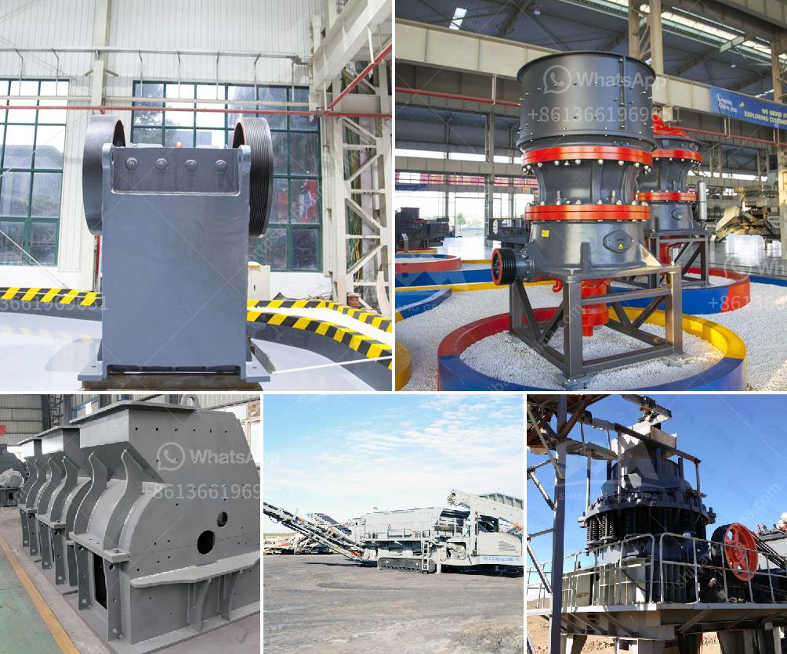

<h3>stone crusher machine in peru</h3>
Stone crusher machine is a very important equipment in the mining industry. In Peru, a country rich in resources, it helps not only the mining industry, but also the construction industry and other industries. With its wide range of applications, it is an indispensable machine in the quarrying and mining industry.

The stone crusher machine is used for crushing ores, stones, rocks into smaller pieces for further processing. This machine can be used in many industries such as mining, construction, metallurgy and so on. It is used for crushing various types of materials, such as limestone, granite, river pebbles, pebbles, quartz stone, marble, iron ore, copper ore, manganese ore, coal gangue, non-ferrous metal ore, pebbles, etc.

The stone crusher machine in Peru is divided into many types, such as jaw crusher, cone crusher, impact crusher, hammer crusher and so on. These different types have different specifications, suitable for different crushing projects. For example, jaw crusher is suitable for coarse crushing of materials, cone crusher and impact crusher are suitable for medium and fine crushing of materials, hammer crusher is suitable for crushing brittle materials, etc.

In addition to the different types, the stone crusher machine has different models. These models have different capacities, motor powers, feed sizes, discharge sizes, etc. When choosing a suitable model, customers should select an appropriate machine based on their actual needs and the specific requirements of the production line.

The stone crusher machine in Peru has many advantages. First, it has high efficiency and large crushing ratio. It can crush large pieces of ore into fine particles without over-crushing the material. Second, it has a stable performance and reliable operation. The machine is equipped with advanced technology and has undergone strict quality control. It can work continuously for a long time without failure. Third, it is easy to maintain and repair. The machine is designed with a simple structure and is easy to operate, maintain and repair. It reduces downtime and improves work efficiency.

The stone crusher machine in Peru has a wide range of applications. It can be used for primary crushing, secondary crushing and fine crushing of raw materials. It can be used in various production lines, such as stone production line, sand production line, cement production line, etc. It is also widely used in various industries, such as mining, metallurgy, building materials, highways, railways, water conservancy and chemical industries.

In conclusion, the stone crusher machine in Peru plays an important role in the mining industry. It is a necessary equipment for the crushing of various ores, stones, rocks and other materials. With its high efficiency, stable performance and wide range of applications, it is favored by customers. Whether it is used in the quarrying industry or in the construction industry, it can effectively improve the production efficiency and create more economic benefits.
<h3>Contact us</h3><ul><li><strong>Whatsapp:&nbsp;<a href="https://wa.me/8613661969651">+8613661969651</a></strong></li><li><a href="https://swt.shibang-china.com/?git&amp;zhl&amp;stone crusher machine in peru"><strong>Online Service(chat now)</strong></a></li></ul><h3>Related</h3><ul><li><a href='project proposal on stone crushing mill small scale.md'>project proposal on stone crushing mill small scale</a></li><li><a href='zhauns south africa price list pdf.md'>zhauns south africa price list pdf</a></li><li><a href='gold mining and crusher machinery.md'>gold mining and crusher machinery</a></li><li><a href='equipment used in iron ore beneficiation.md'>equipment used in iron ore beneficiation</a></li><li><a href='stone gravel crusher price at ranchi.md'>stone gravel crusher price at ranchi</a></li></ul>