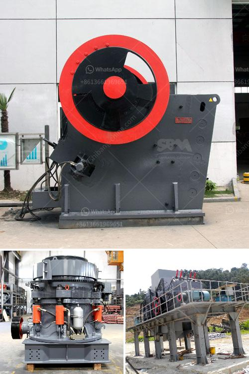

<h3>stone crusher machine in turkey</h3>
Turkey, a country located in western Asia, has a rich history of stone crushing. In ancient times, the machinery used to break stone into smaller pieces was called a stone crusher and it was powered by human or animal muscle. Nowadays, machines capable of crushing hundreds of tonnes of stone per hour are available. This has made stone crushing a lucrative business in Turkey.

Stone crusher machines are vital equipment in many industries, such as mining, construction, ceramics, metallurgy, chemical industry, and highways. The stone crushing factory in Turkey can be seen from the name of the stone crusher machines. This article will briefly introduce the stone crusher machine in Turkey.

First, let's introduce the jaw crusher machine. Jaw crushers are mainly used for crushing hard and abrasive materials with compressive strength not exceeding 320 MPa. It has a simple structure, reliable operation, low operating costs, and energy-saving features. The jaw crusher is popular in the mining industry, metallurgy, construction, highway, railway, water conservancy, and chemical industries.

The cone crusher, also known as the multi-cylinder hydraulic cone crusher, is a more advanced crusher that provides higher production capacity, better product quality, and more uniform particle size. It can be widely used in the medium, fine, and ultra-fine crushing operations of rock, ore, slag, refractory materials, etc. The cone crusher machine is often used in large-scale projects such as building aggregates, mining, and solid waste treatment.

The impact crusher is another commonly used stone crushing machine in Turkey. It is used to crush medium-hard and soft materials, such as limestone, gypsum, marble, calcite, dolomite, and other minerals. Impact crushers are widely used in construction, mining, and chemical industries due to their simple structure, high crushing ratio, energy-saving, and environmental protection features.

Turkey also has a significant share in the production of other types of stone crusher machines. For example, mobile crushers are widely used in the field of construction waste crushing, mining, and quarrying. It is economical, flexible, and convenient, with compact structure and strong maneuverability. Mobile crushers can be customized according to customer requirements to meet different production needs.

In addition, Turkey also produces vibrating feeders, vibrating screens, sand making machines, belt conveyors, and other auxiliary equipment related to stone crushing. These machines are essential for the efficient operation of stone crushing plants.

In conclusion, stone crusher machines in Turkey play a vital role in the mining and construction industry because of their capabilities to crush hard and abrasive materials. The jaw crusher, cone crusher, and impact crusher are commonly used in the primary, secondary, and tertiary crushing processes. Moreover, mobile crushers and other auxiliary equipment provide great flexibility and convenience. With continuous improvements in technology, the stone crushing industry in Turkey is expected to further expand in the future.
<h3>Contact us</h3><ul><li><strong>Whatsapp:&nbsp;<a href="https://wa.me/8613661969651">+8613661969651</a></strong></li><li><a href="https://swt.shibang-china.com/?git&amp;zhl&amp;stone crusher machine in turkey"><strong>Online Service(chat now)</strong></a></li></ul><h3>Related</h3><ul><li><a href='vertical mill china.md'>vertical mill china</a></li><li><a href='20 tph ball mills price.md'>20 tph ball mills price</a></li><li><a href='chrome washing plant for sale south africa.md'>chrome washing plant for sale south africa</a></li><li><a href='aggregate crusher for sale in philippines.md'>aggregate crusher for sale in philippines</a></li><li><a href='jaw crusher prices.md'>jaw crusher prices</a></li></ul>